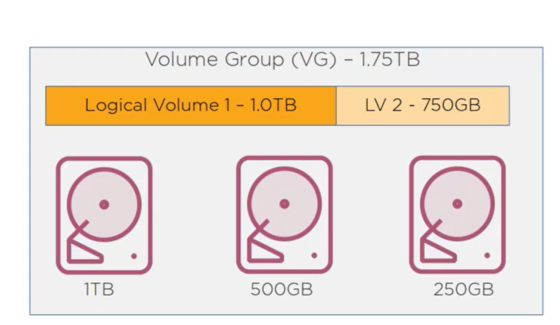
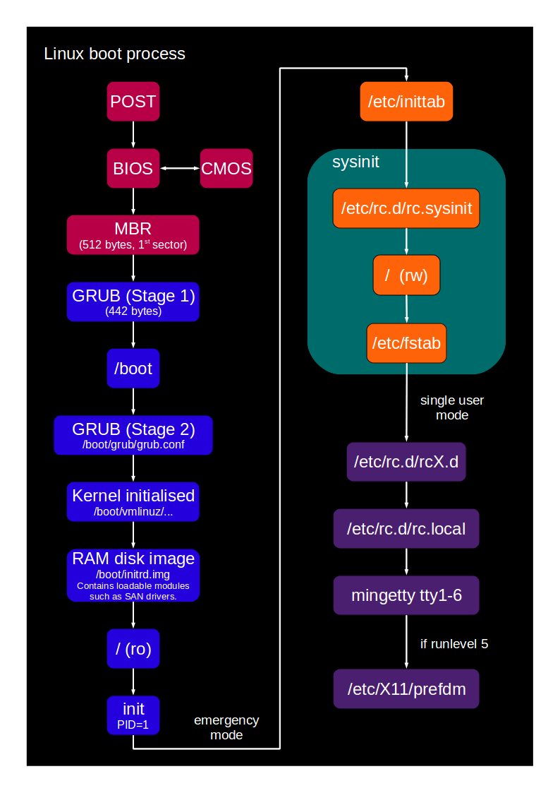

## Linux and the Open Source Community

### Open Source Licensing Models

- Free Software Foundation
  - GPL (Linux Kernel)
- Open Source Initiative (OSI)
- Creative Commons
- BSD
- Apache
- MIT

Kernel Linux is based on the GNU Public License → Open Source : denoting software for which the original source code is made freely available and may be redistributed and modified.

### Free Software

- FOSS: Free and Open Source Software
- FLOSS: Free/Libre and Open Source Software

### The Linux Ecosystem

Linux kernel was created by Linus Torvalds in the early 1990’s and then donated to the community.

A computer operating system is effectively a set of software tools designed to interpret a user’s command, so that can be translated into terms the host computer can understand.

There is two way to interact with the OS, command line interface or graphic user interface.

The Linux kernel is free, customizable (rebuild Linux to taste), flexible (move drives between machines), virtualization.

The layers of a Linux Distribution :

- The Linux kernel handles system hardware resource on behalf of the user
- A Linux desktop is a software designed to manage graphic interface features like windows, menus, and application controls
- A Linux distribution will use a specific suite of system tools (like software package managers and process managers)

### Linux Distributions

Because Linux is free, people and community decide to create their own Linux based Operating System.

- Debian
  - Ubuntu, Mint
- Red Hat Enterprise Linux
  - CentOS, Fedora, Rocky Linux
- SUSE
  - OpenSUSE
- Arch Linux

LTS stand for Long-Term Support is a releases of a Linux Distributions that are built to be as stable a possible using only fully tested software and configurations. The reliability of such configurations makes it possible for the distro managers to continue to provide security and features updates to a release for as long as 5 years.

## Installing Linux

Need an ISO and a media / devices to contains the ISO file for booting and installing Linux.

Language selection → Keyboard Layout → Installation Type (Normal, Minimal) → Disk choose + Partitioning →  Localization for time zone → Network Configuration → Create user  

LVM (Logical Volume Manager)



### Installing Scripted Instances

Build Images with Docker Compose and run it with the Docker Engine

Use Web services like Azure / GWS / AWS to run Linux Instances in cloud

## Configuring the Linux Environment

## Linux start up

### boot process 

1. BIOS / UEFI → Firmware in the mother board (ROM)
2. MBR / GPT → Looking for a disk devices on boot and mount it
3. GRUB → If that storage has Linux installed, bootloader script called GRUB is executed
4. Linux Kernel → Load the OS kernel into the RAM
5. init (SysVInit) or  Systemd → pid=1 that executes config file targets (run levels)
6. Display manager loaded
7. If run levels 5 then load desktop



The /boot directory contains vmlinuz file that are a compressed version of working Linux Kernel, other file ending with generic perform various tasks in support of the actual kernel when it’s run.

Each files had the kernel version in their name. If grub is used as the bootloader, a subdirectory called grub is present in /boot , and the file grub.cfg describe the contents of the grub page that is showed during the boot process on the screen. It’s automatically generated by /etc/defautl/grub.

See /etc/grub.d for more details, once finish run ``sudo update-grub``.

### Linux Runlevels

Runlevels are just codes used to tell Linux how the OS should be running

Linux is a multi-user systems

SysVInit is currently redirected to the new systemd version

- 0 system halt → Poweroff.target
- 1 single-user (rescue) mode → rescue.target
- 3 multi-user mode without GUI (x11 server not used) → multi-user.target
- 5 multi-user mode with GUI → graphical.target
- 6 reboot → reboot.target

```bash
sudo systemctl get-default
graphical.target
sudo systemctl isolate rescue.target
sudo systemctl enable multi-user.target # same as isolate 
```

## The Linux File System Hierarchy Standard

Linux = Directory, Windows = Folder

Root directory is  /

Root-level directories

| /bin       | Binary files for (single user mode) system commands   |
| --- | --- |
| /sbin | System binary files  for (multi user mode) system commands |
| /boot | Linux images and boot configuration files  |
| /dev | Pseudo files representing and providing controls over all physical and virtual devices   |
| /etc | Configuring files for software  |
| /home | User files |
| /lib | Software library dependencies  |
| /root | Root user files |
| /usr | Additional binaries and datafiles those binaries need |
| /var | Updating files : logs, application data and cache |

Pseudo Files directories (virtual and ephemeral)

| /proc  | Files representing running system processes  |
| --- | --- |
| /dev  | Pseudo files representing devices  |
| /sys  | Data on system and kernel resources  |

For example **/sys/block/sda/** contains all information about the hard drive sda.

For security reasons admins normally won’t log in a Linux system as the root user.

WSL = bash for use and manage windows

### Managing Linux Environments

The command `locale` return all settings about your geographic location.

```bash
locale 
localectl set-locale LANG=fr_FR.utf8  # Set up french language
loadkeys fr                           # Set up french keyboard
```

In **/usr/share/i18n/locales** are stocked all information about all languages and keyboard layout for the Linux environments. Change it with the command ``localectl``.

However you can use the command timedatectl instead :

```bash
timedatectl list-timezones | grep -i europe

timedatectl set-timezone Europe/Paris
```

Present Working Directory

```bash
pwd 
/home/user/app
echo $PWD
/home/user/app
```

***$PWD*** is a shell variable, also called environment variables.

Below are some of the most common environment variables:

- `USER` - The current logged in user.
- `HOME` - The home directory of the current user.
- `EDITOR` - The default file editor to be used. This is the editor that will be used when you type `edit` in your terminal.
- `SHELL` - The path of the current user’s shell, such as bash or zsh.
- `LOGNAME` - The name of the current user.
- `PATH` - A list of directories to be searched when executing commands. When you run a command the system will search those directories in this order and use the first found executable.
- `LANG` - The current locales settings.
- `TERM` - The current terminal emulation.
- `MAIL` - Location of where the current user’s mail is stored.

 See the environment variables

```bash
printenv HOME LANG
/home/user
fr_FR

env | less    #return all environment variables
set | less   #return environment variables and shell functions that you can use
```

Set and unset an environment variables

```bash
export EX="example"   #set an environment variables 
echo $EX 
example

unset EX              #unset an environment variables
```

Save environment variable for a user

```bash
echo 'export EX="example"' >> ~/.bash_profile
source ./bash_profile
```

Adding a path to the Linux path variable

```bash
echo $PATH #return the content of the variable 
export PATH=$PATH:/some/new/path # Add a new path kepping the old path 

echo 'export PATH=$PATH:/some/new/path' >> ~/.bash_profile
source ~/.bash_profile
```

For combine multiple command you can use a command named pipe ( | ).

Example of using pipe:

```bash
cmd1 | cmd2
```

The ***history*** command allow you to get an history a your previously taped command. The command read the file ***.bash_history.***

```bash
history 
```

The command ***type*** tell you how a specified word would be interpreted by bash:

```bash
type echo
echo is a shell builtin

type vim
vim is /usr/bin/vim
```

By the way there is a similar ***type*** command, called ***whereis*** :

```bash
whereis echo
echo: /usr/bin/echo /usr/share/man/man1/echo.1.gz

whereis vim
vim: /usr/bin/vim /usr/bin/vim.tiny /usr/bin/vim.basic /etc/vim /usr/share/vim /usr/share/man/man1/vim.1.gz
```

### Managing System Hardware

⚠️ Before removing or adding any plugin card or memory module make sure the power is off.

The motherboard contains the slots and connectors to which your components will be installed and the circuitry and data busses that transport data and electricity between them.  

Take time to choose the good component or resources to your Linux System (CPU, RAM, Disk Space, Disk Speed, RAID, Partitioning, Network configuration) according to your project.

Display all the block devices currently mounted on your system

```bash
df -hTt ext4
Filesystem     Type  Size  Used Avail Use% Mounted on
/dev/sdb       ext4  251G  1.1G  238G   1% /

df --help
-h, --human-readable  print sizes in powers of 1024 (e.g., 1023M)
-t, --type=TYPE       limit listing to file systems of type TYPE
-T, --print-type      print file system type
```

We can see that our hard disk is formatted in ext4, it have 251 GB of space and it mounted on the root directory.

**/dev/sdb** its the virtual addresses for disk drives

**/dev/sdb1** its the virtual addresses for the first partition of the disk drive sdb

So all devices, including DVD, USB drives and modems are represented by a file in the /dev directory.

If a drive doesn’t appear in the output of ``df`` it might simply not mounted. With ``lsblk`` you can list all of the block devices attached to your system.

```bash
lsblk
NAME MAJ:MIN RM  SIZE RO TYPE MOUNTPOINT
sda    8:0    0  256G  0 disk
|-sda1 8:1    0  256G  0 part 
sdb    8:16   0  256G  0 disk /
```

Now you gonna mount the /dev/sda1 partition to /media/newplace :

```bash
mkdir /media/newplace/
sudo mount /dev/sda1 /media/newplace

df -hTt ext4
Filesystem     Type  Size  Used Avail Use% Mounted on
/dev/sdb       ext4  251G  1.1G  238G   1% /
/dev/sda1      ext4  251G  1.1G  238G   1% /media/newplace

```

Another important tool for discovering all the bits and pieces you’ve got attached to your system is ``dmesg``. It will display messages relating to the kernel ring buffer, which, in practical terms, can tell you a lot about how the system understands its physical environment.

```bash
dmesg 
[    2.829317] sd 0:0:0:1: [sdb] Attached SCSI disk
[    2.842928] EXT4-fs (sdb): mounted filesystem with ordered data mode. Opts: discard,errors=remount-ro,data=ordered
[    2.863427] FS-Cache: Duplicate cookie detected
[    2.863429] FS-Cache: O-cookie c=0000000004e2937f [p=0000000025472583 fl=222 nc=0 na=1]
[    2.863430] FS-Cache: O-cookie d=00000000718e636a n=00000000bcae137b
[    2.863430] FS-Cache: O-key=[10] '34323934393337353732'
[    2.863433] FS-Cache: N-cookie c=00000000f1d2c24c [p=0000000025472583 fl=2 nc=0 na=1]
[    2.863433] FS-Cache: N-cookie d=00000000718e636a n=00000000afa4dea8
[    2.863434] FS-Cache: N-key=[10] '34323934393337353732'
[   49.187298] hv_balloon: Max. dynamic memory size: 12850 MB
```

Use ``grep`` for more power full search in the kernel buffer. There is also some option to the ``dmesg`` command

```bash
dmesg -T                   #Human-readable timestamp 
dmesg -l <level> , <level> #{info/debug/notice/warn/err/crit/alert/emerg}  
dmesg -f <facility>        #{kern/user/mail/daemon/auth/syslog/lpr/news}
```

List all information about your system hardware with the command ``lshw``:

```bash
sudo lshw | less  
```

## Configuring the Linux Desktop Experience

### Working with Linux Software Repositories

Linux distributions comes with integrated package management systems that provide access to vast curated repositories of software applications.

For debian and debian based distro : APT (remote packages) and DPKG (local packages)

For RHEL based distro : YUM/DNF (remote packages) and RPM (local packages)

For Arch based distro : Pacman (remote and local packages)

```bash
cd /etc/apt
ls
apt.conf.d  auth.conf.d  preferences.d  sources.list  sources.list.d  trusted.gpg.d

```

The **source.list** file contains all the repository information the app system will need to faithfully do its job.  

#### Explanation of the software repository format

- **deb**: These repositories contain binaries or precompiled packages. These repositories are required for most users.
- **deb-src**: These repositories contain the source code of the packages. Useful for developers.
- **<http://archive.ubuntu.com/ubuntu>**: The URI (Uniform Resource Identifier), in this case a location on the internet. See the [official mirror list](https://launchpad.net/ubuntu/+archivemirrors) or the self-maintained [mirror list](https://wiki.ubuntu.com/Archive) to find other mirrors. (or see the official website of your distro)
- **focal** is the release name or version of your distribution.
- **main** & **restricted** are the section names or [components](https://help.ubuntu.com/community/Repositories/CommandLine#what). There can be several section names, separated by spaces. Packages. The four main repositories are:
  - **Main** - Distro dev team (Debian Project  / Canonical / etc) supported free and open-source software.
  - **Universe** - Community-maintained free and open-source software.
  - **Restricted** - Proprietary drivers for devices.
  - **Multiverse** - Software restricted by copyright or legal issues.

Example of **source.list** file in Ubuntu Focal version :

```plain
deb http://archive.ubuntu.com/ubuntu/ focal main restricted
deb http://archive.ubuntu.com/ubuntu/ focal-updates main restricted
deb http://archive.ubuntu.com/ubuntu/ focal universe
deb-src  http://archive.ubuntu.com/ubuntu/ focal-updates universe
deb http://archive.ubuntu.com/ubuntu/ focal multiverse
deb http://archive.ubuntu.com/ubuntu/ focal-updates multiverse
deb http://archive.ubuntu.com/ubuntu/ focal-backports main restricted universe multiverse
deb http://security.ubuntu.com/ubuntu/ focal-security main restricted
deb http://security.ubuntu.com/ubuntu/ focal-security universe
deb http://security.ubuntu.com/ubuntu/ focal-security multiverse

```

Third-party repositories are added to files in the ***sources.list.d*** directory.

 Return the total of available package in main, universe, restricted and multiverse repository :

```bash
apt list --all-versions | wc -l 
```

If you'd rather use your CD-ROM for installing packages or updating your system automatically with APT, you can put it in your /etc/apt/sources.list. To do so, you can use the [apt-cdrom](https://manpages.debian.org/man/8/apt-cdrom) program like this:

``` bash
apt-cdrom add
```

with the Debian CD-ROM in the drive. You can use -d for the directory of the CD-ROM mount point or add a non-CD mount point (i.e. a USB keydrive).

#### How APT work :

Before you can confidently install first package you should make sure the local software index being used by APT matches what’s actually going on with the online repositories.  Make this before ant APT operation.

```bash
sudo apt update # Download the latest repo data 
```

Return upgradable package with this command :

```bash
apt list --upgradable
```

Search for a package thanks to this command :

```bash
apt search nginx
Sorting... Done
Full Text Search... Done
libnginx-mod-http-image-filter/focal 1.17.10-0ubuntu1 amd64
  HTTP image filter module for Nginx

libnginx-mod-mail/focal 1.17.10-0ubuntu1 amd64
  Mail module for Nginx

libnginx-mod-stream/focal 1.17.10-0ubuntu1 amd64
  Stream module for Nginx

nginx/focal 1.17.10-0ubuntu1 all
  small, powerful, scalable web/proxy server

nginx-common/focal 1.17.10-0ubuntu1 all
  small, powerful, scalable web/proxy server - common files

nginx-core/focal 1.17.10-0ubuntu1 amd64
  nginx web/proxy server (standard version)

nginx-doc/focal 1.17.10-0ubuntu1 all
  small, powerful, scalable web/proxy server - documentation
```

Get more details about package via apt show option:

```bash
apt show nginx 
Package: nginx
Version: 1.18.0-0ubuntu1.3
Priority: optional
Section: web
Origin: Ubuntu
Maintainer: Ubuntu Developers <ubuntu-devel-discuss@lists.ubuntu.com>
Original-Maintainer: Debian Nginx Maintainers <pkg-nginx-maintainers@lists.alioth.debian.org>
Bugs: https://bugs.launchpad.net/ubuntu/+filebug
Installed-Size: 45.1 kB
Depends: nginx-core (<< 1.18.0-0ubuntu1.3.1~) | nginx-full (<< 1.18.0-0ubuntu1.3.1~) | nginx-light (<< 1.18.0-0ubuntu1.3.1~) | nginx-extras (<< 1.18.0-0ubuntu1.3.1~), nginx-core (>= 1.18.0-0ubuntu1.3) | nginx-full (>= 1.18.0-0ubuntu1.3) | nginx-light (>= 1.18.0-0ubuntu1.3) | nginx-extras (>= 1.18.0-0ubuntu1.3)
Homepage: http://nginx.net
Download-Size: 3620 B
APT-Sources: http://archive.ubuntu.com/ubuntu focal-updates/main amd64 Packages
Description: small, powerful, scalable web/proxy server
 Nginx ("engine X") is a high-performance web and reverse proxy server
 created by Igor Sysoev. It can be used both as a standalone web server
 and as a proxy to reduce the load on back-end HTTP or mail servers.
 .
 This is a dependency package to install either nginx-full (by default),
 nginx-light or nginx-extras.
```

So for install the package do :

```bash
sudo apt install nginx  
```

Return dependencies :

```bash
apt depends nginx
```

#### How YUM work :

```bash
yum list nginx
yum info nginx
yum install nginx  
```

## Linux Desktop

- Cinnamon/Mate
- Gnome
- Xfce

## Working with the Linux Server

### What is a server?

The server jobs its to serve the need of a remote user, usually called a client

### Using Linux Containers

Server virtualization is a technique or a collection of techniques, for partitioning a subset of a physical computer’s compute storage, and memory resources, and using that subset to launch an independent OS.

There is two way to use containers with Linux, the first one its with docker, you virtualize an application and his dependencies, the seconds one its with LXC/LXD (LinuX Containers), you virtualize an entirely OS thanks to the containers technology. The containers technology is native in Linux.

With LXD you can create easily a Linux Lab. LXD is an evolve version of LXC.

- lxd doc

<https://linuxcontainers.org/lxd/docs/latest/installing/>

- Windows Install

<https://chocolatey.org/install#individual>

<https://community.chocolatey.org/packages/lxc>

- Linux Install

<https://ubuntu.com/server/docs/containers-lxc>

```bash
sudo apt install lxc
```

```bash
sudo lxc-create -t download -n labs1 -- --dist ubuntu --release focal --arch amd64
Downloading the image index
Downloading the rootfs
Downloading the metadata
The image cache is now ready
Unpacking the rootfs

---
You just created an Ubuntu focal amd64 (20221114_08:32) container.

To enable SSH, run: apt install openssh-server
No default root or user password are set by LXC.
```

<https://ubuntu.com/server/docs/containers-lxd>

```bash
sudo lxc launch images:centos/7/amd64 centos7
sudo lxc list  # Persistent means automatically start up at the host boot
sudo lxc exec centos7 /bin/bash
```

### Installing and Working with Server Apps : Apache

```bash
sudo apt install apache2
sudo systemctl start apache2
sudo systemct enable apache2
ls /var/www/html # Web root
curl http://<ip_address>
```

### Installing and Working with Server Apps : Nextcloud

Snaps are a relatively new class of package manager that were designed simplify software installation and administration by providing a highly predictable and standardized infrastructure, but it’s also about enhancing server security. In a way its a kind of virtual partition that exists within your file system inside its own isolated environment.

```bash
snap install nextcloud 
cd /var/snap
ls 
core nextcloud
cd nextcloud/
ls
10314 common current
cd 10314/
ls 
apache certs mysql nextcloud php redis 
```

### Compiling Code in Linux

Risks of compiling code instead of use package manager :

- No automated security patches
- Dependencies broken by system updates
- Unreliable source codes rep

Install from code sources

```bash
sudo apt install build-essential # install dependencies for compiling code 
wget https://nmap.org/dist/nmap-7.93.tgz
ls
nmap-7.70.tgz
tar xzf nmap-7.70.tgz
ls 
nmap-7.70 nmap-7.70.tgz
cd nmap-7.70
./configure # install dependencies of the application
make # read the make file and run actual compile operation    
make install 
nmap localhost 
```
