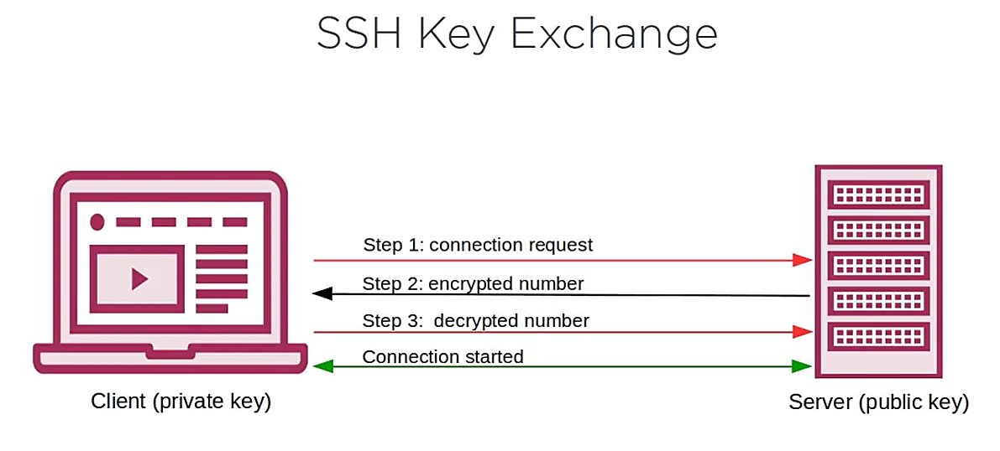

# Working with the Linux Command Line Basics

## Using Linux Help Resources

```bash
man cmd

sudo apt install man-db  

cd /usr/share/doc #contains documentation about Linux command 

cmd --help

whatis cmd

type cmd

apropos cmd 
 
```

## The Linux Terminal

When you run a terminal a new shell session is created for you using the defaults settings in a hidden file called ***.bashsrc*** there is define terminal color, history file size, etc.

## Linux Command Syntax Patterns and Shortcuts

Command Syntax that are possible:

```bash
cmd [options] <arguments>
```

Shortcut

- `tab` - autocompletion
- `cd` - change directory to home directory
- `cd -`  - go to the previous directory
- `ctrl + r` - reverse search
- `ESC + .` - recall last argument

```bash
history 
cat .bash_history 
```

## Navigating the Linux File System

### Working with Files and Directories

Create a script directories for your user in the home directory.

```bash
cd             # Change directory
pwd            # Present working directory
mkdir <dir>    # Make a directory
ls             # List a directory
touch <file>   # Create a file 
cp <src> <dst> # Copy file
mv <src> <dst> # Move file
rmdir <dir>    # Remove a directory 
```

Linux concept = File, all are a file

Since UNIX V6 there was a program ***/etc/glob*** that would expand wildcard patterns. Soon afterward this became a shell built-in.

Glob called also globing, look like an asterisk (*) and an interrogation mark (?). Example :

```bash
ls /*
cp b*.txt ./newdir
rm *

ls
file1 file11 file12 file2 file3 file4 file5
rm file?   # the symbol represent one character
ls
file11 file12
rm file??
ls 
```

## Searching the Linux File System

```bash
whereis cmd
locate adduser
cat /etc/group | grep root

head
tail 
grep
find /etc -name "file.txt"
cut -d: -f3
uniq
sort -n
wc 
awk
sed 
```

``| combine``

``>> append``

``> overwrite``

When you run a command there is 3 standard streams :

| Name | Designation  | Numeric code  | What |
| --- | --- | --- | --- |
| Standard Input | stdin | 0 | Keyboard / bash |
| Standard Output | stdout | 1 | Screen / terminal |
| Standard Error | stderr | 2 | Screen / terminal |

Error only redirection (because error are send to the screen / terminal) :

```bash
wget google.cooom 2> errorfile.txt
```

## Working with Archives

The common tools to archives a file is tar (tape archive), and the commons tools to compress a file is gzip.

```bash
tar xzf file.tar.gz  # Unpack / Extract the file 
tar czf file.tar.gz  # Create a compressed archive of the file 

tar cf largearchive.tar mydir/ # Create an archive of a directory
gzip largearchive.tar          # Compress the archive 
```

## Linux Kernel Modules and Peripherals

```bash
lsudb
lspci
lshw 
```

The Linux Kernel modules are pieces of code that can be loaded and unloaded into the kernel upon demand. They increase the Kernel functionality within reboot the system.

The software files that make up kernel modules are usually kept in the ***lib/modules*** directory.

The things is though that the module you’ll want to use will depend on the Linux Kernel version you’re running.

```bash
uname -r # Return the kernel version
cd /lib/modules/`uname -r`/kernel
cd ./sound
ls 
soundcore.ko
modprobe soundcore
lsmod    # List loaded modules
```

## Linux network connectivity

To be properly connected to internet your Linux Server need an IP addresses, a mask, a default gateway, a DNS, and a Name.

An IP address is a number used to identify a network interface on a computer on a local network or the Internet. In the currently most widespread version of IP (IPv4), this number is encoded in 32 bits, and is usually represented as 4 numbers separated by periods (e.g. **`192.168.0.1`**
), each number being between 0 and 255 (inclusive, which corresponds to 8 bits of data). The next version of the protocol, IPv6, extends this addressing space to 128 bits, and the addresses are generally represented as a series of hexadecimal numbers separated by colons (e.g., 2001:0db8:13bb:0002:0000:0000:0000:0020, or 2001:db8:13bb:2::20 for short).

 First, learn the defaults gateway and route for each network card.

```bash
ip route 
default via 172.24.0.1 dev eth0
172.24.0.0/20 dev eth0 proto kernel scope link src 172.24.5.55
```

```bash
sudo dhclient
```

```bash
ip a
```

**lo** card stand for the loop back interface a virtual interface allows connectivity to local resources.
**eth** card stand for ethernet card.
**wl** card stand for wireless card.

Get TCP connection and open port on server :

```bash
ss -pantlu 
```

### Domain Name System (DNS)

See if the DNS services is well configured :

```bash
host google.com
google.com has address 142.250.180.14
google.com has IPv6 address 2a00:1450:4009:81e::200e
google.com mail is handled by 10 smtp.google.com.
```

See if an address is alive :

```bash
ping 142.250.180.14
PING 142.250.180.14 (142.250.180.14) 56(84) bytes of data.
64 bytes from 142.250.180.14: icmp_seq=1 ttl=110 time=84.6 ms

ping google.com
PING google.com (142.250.180.14) 56(84) bytes of data.
64 bytes from lhr25s32-in-f14.1e100.net (142.250.180.14): icmp_seq=1 ttl=110 time=81.3 ms
```

The file ***/etc/resolv.conf*** contains the nameserver address.

Confirm the change with :

```bash
systemd-resolve --status # Then go check for your network card
```

The file ***/etc/hosts*** contains local name mapping. (ex: 127.0.0.1 = localhost).

## Remote connections and SSH

SSH stand for secure shell, its a protocol that natively listen to the port TCP 22.

This protocol allows people to access remotely and virtually servers, in a secure way.

Remote is the new local :

- Accessing headless servers
- Accessing virtual machines
- Accessing workloads on distant servers

The service is OpenSSH.



The server host the sessions.

```bash
apt install openssh-server
yum install openssh-server
```

And for client

```bash
apt install openssh-client
yum install openssh-clients
```

***/etc/ssh*** contains configuration files
***sshd_config*** file for configure ssh login.

Start SSH connection :

```bash
ssh user@10.39.249.250
ssh -p 2222 user@10.39.249.250                     # Use a non-standard network port 
ssh -i /home/localuser/mykeyfile.pem user@10.39.249.250 # Use a non-default key pair 
```

Secure copy file :

```bash
scp update-local.sh user@10.39.249.250:/home/user
```

## Linux Scripting

The first line of every script has to tell Linux that’s it’s an executable scripts and which shell interpreter we’re going to use.

 Shebang line :

```bash
#!/bin/bash 
```

Declare a variable :

```bash
declare -i number1  # Declare an integer variable
```

Assign value to a variable

```bash
declare -i int_value
int_value=10              # An integer

string_value=10           # A string
```

Print a text to the screen :

```bash
echo "this is a text"
echo "Hey your number is" $number1
```

Read what the user entered and assign it to a variable:

```bash
read number1 
```

Create a variable :

```bash
total=$number1*$number1
```

Create a loop :

```bash
for i in {0..10..2}  # 0 to 10, 2 by 2
 do 
  //instruction with or not with $i
 done
```

```bash
for filename in file1 file2 file3
 do
  echo "Important stuff" >> $filename
 done
```

If conditions :

```bash
if test $text1 != $text2; then      # Test string 
 echo "I guess opposites attract."
else 
 echo "You two do think alike!"
fi
exit 0
```

Create a while loop:

```bash
declare -i counter
counter=10
while [ $counter -gt 2 ];do #GT = Greather Than 
 echo $counter
 counter=counter-1 
done 
```

Create a case statement :

```bash
case $weather in
 sunny | warm ) echo $weather
 ;;
 cloudy | cool ) echo $weather
 ;;
 rainy | cold ) echo $weather
 ;;
 * ) echo $weather
 ;;
esac 
```

Exit the script  :

```bash
exit 0
```

Make the file executable :

```bash
chmod +x myscript.sh
```

Run the script:

```bash
./myscript.sh
sh myscript.sh
```

Learn tools to bash scripting with :

```bash
man builtins
```
