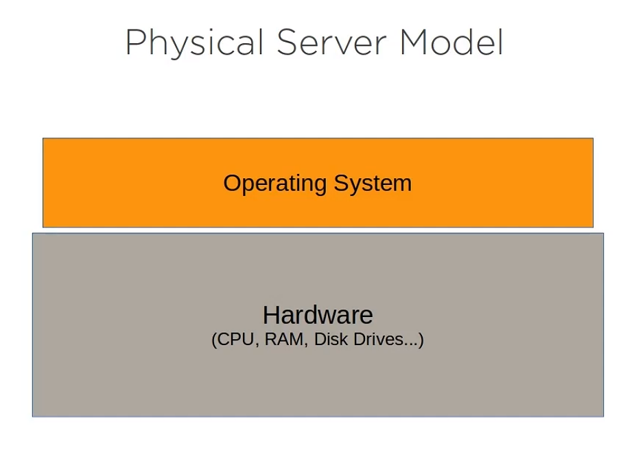
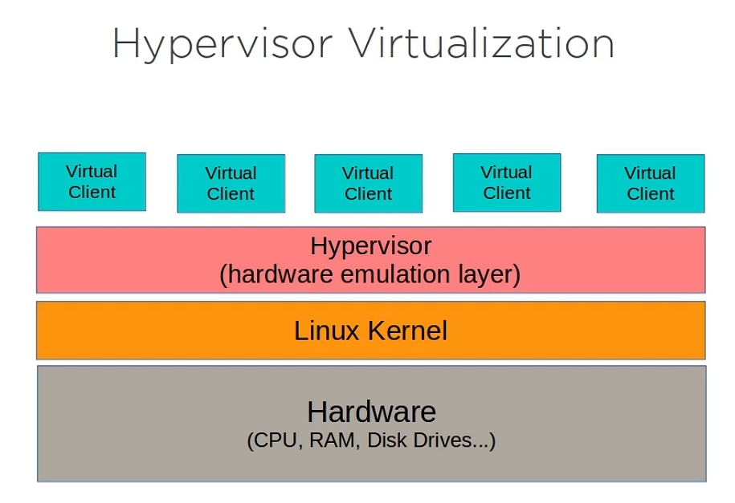
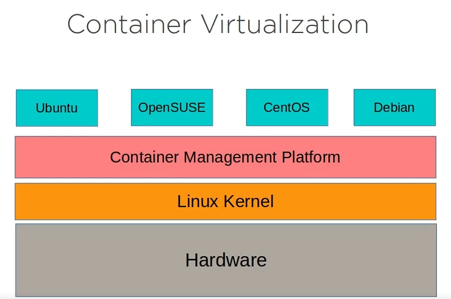

# Optimizing your Linux System

## Monitor System Resources

Why monitor :

- Understand capacity usage
- Identify (and terminate) rogue processes

See the capacity and usage levels of your system memory.

```bash
less /proc/meminfo 

free -h
```

See the capacity and specification of the CPU cores in system.

```bash
less /proc/cpuinfo
```

See the uptime of the system

```bash
uptime 
```

Monitor in real time the system and services.

```bash
top 
```

State of all these storage devices currently.

```bash
df -h
```

Monitor network with :

```bash
iftop   # Install package before 
```

## Managing System Processes

Monitor process with ps :

```bash
ps 

ps aux 
```

For see services and processes log :

```bash
journalctl   # Services log manage by systemd
journalctl --since "10 minutes ago"

cd /var/log # Services log manage by syslogd
cat syslog 

dmesg       # Manage kernel message 
```

```bash
yes > /dev/null &       # Run a command (yes) in background
[1] 717
ps                      # Show the PID (process ID) of the yes command
  PID TTY          TIME CMD
    9 pts/0    00:00:01 bash
  717 pts/0    00:00:02 yes
  718 pts/0    00:00:00 ps
kill 717               # Kill the yes command

killall yes            # Kill all yes command (dangerous way)

```

Manage services with systemd :

```bash
sudo systemcl status nginx      # Get status from a services 

sudo systemcl enabled nginx     # Enabled running service at boot
sudo systemcl disabled nginx    # Disable running service at boot

sudo systemcl start nginx       # Start service
sudo systemcl stop nginx        # Stop service
```

## Managing Process Priorities

For manage process priorities, you have to use the ***nice*** command. The command create a process that the  system give a particular CPU priority, thus giving the process more or less CPU time than other processes.

```bash
nice -<value> <command>
nice -19 yes > /dev/null &     # Highest value 
nice --20 yes > /dev/null &    # Lowest value
```

With renice you can modifies the priorities of a running process.

```bash
renice <value> -p <pid>
renice 15 -p 1834 
```

Use top command for this the nice value . The columns NI is the priorities of process.

## Working with users and groups in Linux

Admin powers : best practices

- Avoid using the root account
- Create unique accounts for each user
- Assign only necessary authority to each user
- Use admin power only via sudo

/etc/passwd→ User information

/etc/group → Group information

/etc/shadow → User password

```bash
id user # Return user and group ids 

who # Tells us which user are currently logged in 

last |less # All system login from the begin of the month 
```

```bash
sudo useradd -m user # See also adduser  
sudo passwd user 
```

```bash
sudo mkdir /var/secret
sudo groupadd secret-group
sudo chown :secret-group /var/secret
sudo usermod -aG  secret-group user 
sudo chmod g+w /var/secret 
```

```bash
su user # use su for Switch User 
```

```bash
cd /etc/skel # Skeleton file for each new user home directory 
ls 
. .. .bash_logout .bashrc .profile 
```

## Securing Your Linux Server

### Applying object permission

All files and directories in Linux have metadata.

```bash
ls -la
drwxr-x--- 4 kportron kportron 4096 Nov 17 13:25 .
```

```
473  d rwx r-x ---                          4 kportron kportron 4096 Nov 17 13:25 .   
 |   | ||| ||| |||_ other / execute right   |     |        |      |       |       |__ Name
 |   | ||| ||| ||__ other / write right     |     |        |      |       |__________ Date of last update 
 |   | ||| ||| |___ other / read right      |     |        |      |__________________ Size 
 |   | ||| |||_____ group / execute right   |     |        |_________________________ group owner
 |   | ||| ||______ group / write right     |     |__________________________________ owner
 |   | ||| |_______ group / read right      |________________________________________ Number of links 
 |   | |||_________ owner / execute right 
 |   | ||__________ owner / write right 
 |   | |___________ owner / read right
 |   | ____________ file type 
 |__________________ inode number 

```

Directories

- Read right : Read what contains the directory
- Write right : Create object in the directory
- Execute right : Move in the directory

File

- Read right : Read the file
- Write right : Modify the file
- Execute right : Execute the file (script/command)

Sticky-bit

One of the peculiarities of rights in Linux is that the right to write to a directory also allows deletion of *all* files, owner or not.

The *sticky-bit* set on the directory will only allow users to delete files they own. This is the basic case for the `/tmp` directory.

So group members will only be able to delete their own file within the directory, but not files belonging to others.

```bash
chmod 1777 directory  # Octal method

chmod o+t directory   # Symbolic method 

ls -l 
drwxrwxrw**t** … directory 
```

Link files

These files give the possibility to give several logical names to the same physical file. A new access point to the file is therefore created.

There are two types of link files:

- Physical links;
- Symbolic links.

### **PHYSICAL LINK**

The link file and the source file have the same *inode* number and the link counter is incremented. It is not possible to link different directories or files from different file systems.

**Warning**

If the source file is destroyed, the counter is decremented and the link file still accesses the file.

### **Command `ln` for a physical link**

The `ln` command allows you to create physical links.

```bash
ls –li letter
666 –rwxr--r-- 1 root root … letter

ln /home/paul/letter /home/jack/read

ls –li /home/*/*
666 –rwxr--r-- 2 root root … letter
666 –rwxr--r-- 2 root root … read
```

!<https://docs.rockylinux.org/books/admin_guide/images/07-file-systems-009.png>

### **SYMBOLIC LINK**

Unlike the physical link, the symbolic link involves the creation of a new *inode*. At the symbolic link level, only a path is stored in the inode table.

The file created contains only an indication of the path to the file. This notion no longer has the limitations of physical links and it is now possible to link directories and files belonging to different file systems.

**Warning**

If the source file is destroyed, the link file can no longer access the file.

### **`ln` command for a symbolic link[¶](https://docs.rockylinux.org/books/admin_guide/07-file-systems/#ln-command-for-a-symbolic-link)**

The command `ln` with the argument `-s` allows to create symbolic links.

```bash
[root]# ls –li letter
666 -rwxr--r-- 1 root root … letter

[root]# ln -s /home/paul/letter /tmp/read

[root]# ls –li /home/paul/letter /tmp/read
666 -rwxr--r--- 1 root root … letter
678 lrwxrwxrwx 1 root root … read -> letter
```

!<https://docs.rockylinux.org/books/admin_guide/images/07-file-systems-010.png>

### Hardening Your Server

Keep up with tech news sources to be warn when a vulnerability appears.

**Software updates :**

Keep your system and software updates  

```bash
apt update 
apt upgrade 

yum update 
```

! yum upgrade -> forces the removal of obsolete package, its risky !

if a kernel panic came after that, boot on the old kernel.

**Services access control :**

- Service hardening
- Port control (close unused port)
- Firewall rules

Use nmap for auto-auditing the system.

### Data encryption

Email Server elements :

- Mail transport agent (MTA) → Postfix, Sendmail
- Mail delivery agent (MDA) → Dovecot
- Mail user agent (MUA) → Thunderbird

## Working with docker and Linux Containers

### What is Container Virtualization







Linux In a container World :

- Host administration
  - Privileges
  - Kernel Access
- Container administration
  - Application design
- The future of Linux
  - Microservices
  - DevOps
  - Development support

### Understanding the Docker Ecosystem

The core piece of the Docker puzzle is the image, which is an archive of the software stack that will be run as a virtual OS, along with any application code it’ll use. You can download pre-built images from online repositories Docker Hub, or create your own.

One way to define or customize your own images is by writing a Dockerfile, which is a simple text script that declare the components and configuration environment you want for your image.

```docker
# Create a webserver on Ubuntu

# Reference an existing OS  
FROM ubuntu:18.04           

# Add software 
RUN apt-get update 
RUN apt-get install -y apache2 
RUN echo "Welcome to my website" > /var/www/html/index.html
EXPOSE 80
```

**Image hosting :**

- Docker Hub
- Docker Registry (LAN) <https://docs.docker.com/registry/>

**Storage :**

- Docker Volumes (These are virtual partition stored)
- Third-party solutions

```bash
docker network ls 
docker network create newnet
```

### Installing Docker Engine on Linux

ubuntu install

```bash
# Setup the repository 
sudo apt update

sudo apt-get install \
    ca-certificates \
    curl \
    gnupg \
    lsb-release

sudo mkdir -p /etc/apt/keyrings
curl -fsSL https://download.docker.com/linux/ubuntu/gpg | sudo gpg --dearmor -o /etc/apt/keyrings/docker.gpg

echo \
  "deb [arch=$(dpkg --print-architecture) signed-by=/etc/apt/keyrings/docker.gpg] https://download.docker.com/linux/ubuntu \
  $(lsb_release -cs) stable" | sudo tee /etc/apt/sources.list.d/docker.list > /dev/null

---------------------------------------------------------------------------------
# Install Docker Engine 
sudo apt-get update

sudo apt-get install docker-ce docker-ce-cli containerd.io docker-compose-plugin

sudo docker run hello-world
```

```bash
sudo docker run -it ubuntu bash  # it for interactive mode, setup a tty terminal with the bash shell
```

```bash
sudo docker ps 

sudo docker ps -a 
```

```bash
usermod -aG Docker user

cat /etc/group
```

### Building a customized Docker Image

```bash
cat << EOF > dockerfile
# Create a webserver on Ubuntu

# Reference an existing OS  
FROM ubuntu:18.04           

# Add software 
RUN apt-get update 
RUN apt-get install -y apache2 
RUN echo "Welcome to my website" > /var/www/html/index.html
EXPOSE 80

EOF        
```

The old command apt-get is use because its more reliable in scripted settings.

When you install a package use the option -y for the apt-get.

EXPOSE 80, listen port 80 in the container.

Build the images :

```bash
docker build -t "webeserver" . 
```

-t  : tag

 .   : to look for a docker file in the current directory

To see the created images :

```bash
docker images 
```

To run a container with the custom images :

```bash
 docker run -d -p 80:80 webser /usr/sbin/apache2ctl -D FOREGROUND 
```

-d : run in background

-p : permit incoming traffic from the host network on port 80, and through port 80 to the container

/usr/sbin/apache2ctl -D FOREGROUND : ensure that Apache actually load when the container start up

Use docker hub via cli

```bash
docker login

docker search nextcloud  

docker tag webserver guy/webserver # retag the images

docker push guy/webserver 
```
