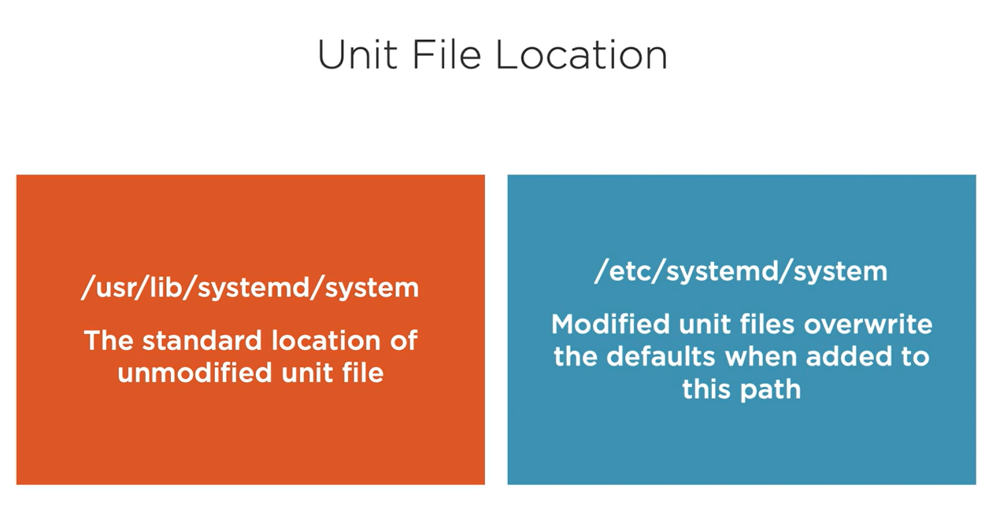

# RHEL 8: Using Essential Tools

## Introduction Red Hat and enterprise Linux

⚠️ All header tagged with (📝) are important to learn for passing the RHCSA cert ! ⚠️

### Red Hat Enterprise Linux

Red Hat Family :

- RHEL - Free but require support subscription for updates
- CentOS - Red Hat rebuild with community support and updates. Project ends December 2021
- Alma Linux
- Rocky Linux
- Fedora 

### 📝 Understanding Linux commands

Running commands:

Linux is case sensitive, commands, options and arguments need to be typed in the correct case.

Hidden file begin with a dot.

```bash
ls # command only will list current directory
ls -a # command with an option to list all file 
ls -l /etc # command with the option for a long listing (metadata) and an argument
```

Gaining help:

Some command have simple help options whist most have manual or man pages. This include the manual page for the command man itself. Other documentation can exist below the /usr/share/doc directory.

```bash
ip addr help 
man ip  
man man  # update man with => sudo mandb
ls /usr/share/doc # Contains HTLM and PDF documentation of installed software 
```

Once RHEL in installed :

- Login to the console
- Check IP address
- Check SSH service is running
- Connect using SSH

```bash
tty # Print the terminal connected to standard input
```

```bash
hostnamectl # Get information about the system 
```

```bash
ip -4 a    # Check the IP addresses of connected network card
ip addr help 

ip route
```

```bash
ss # Utility to investigate sockets 
ss -pantl # Display TCP sockets
ss -panul # Display UDP sockets 
```

```bash
ssh tux@192.168.1.10
exit
```

## Working with text files

### 📝 Understanding Shell Redirection

The command touch can be using to create an empty file. We can also create files using shell redirection. Shell output is normally sent to the console for both STDOUT and STDERR. We can redirect either or both files.

```bash
touch file{1..20}
```

In Linux, everything is a file, so to determinate what type of file your are manipulate use the file command.

```bash
file file1 
file1: ASCII text 
```

STDOUT and STDERR

Output from a command without errors will be sent to STDOUT

Error output from a command will be sent to STDERR

One command may produce output with some errors along with success

Example:

STDOUT

```bash
ls -l /etc/hosts
-rw-r--r-- 1 root root 434 Nov 21 09:59 /etc/hosts
```

STDERR

```bash
ls -l /etc/Hosts
ls: cannot access '/etc/Hosts': No such file or directory
```

Redirecting STDOUT

Non-Error output can be redirected using the greater than operator and directed to a file. Use > to overwrite and >> to append.

Where error occur, they display on console as they have not been redirected.

```bash
ls -l /etc/hosts > output.file

ls -l /etc/hosts /etc/Hosts >> output.file
ls: cannot access '/etc/Hosts': No such file or directory
```

Redirecting STDERR

Error output can be redirected using 2>. Again, the use of 2>> can be used to append rather than overwrite.

```bash
ls -l /etc/Hosts 2> error.file
```

Redirecting STDERR and STDOUT

Output can be configured to a single file if required. Here, all output is redirected to the file called log.

```bash
ls -l /etc/hosts /etc/Hosts &> log  # In the same file 
ls -l /etc/hosts /etc/Hosts >> output.file 2>> error.file # In two distinct file
ls -l /etc/hosts /etc/Hosts > output.file 2> error.file
```

Logging STDERR where is STDOUT

```bash
ls -l /etc/hosts /etc/Hosts > output.file  2>&1
```

Creating text documents using HEREDOCS

Multiline text files can be created from the command line of scripts using HEREDOCS. Any keyword can be used that will not appear in the file text.

```bash
cat > story.txt <<END  # END or anything else 
Line1
Line2
END 

cat > file.file <<EOF
blabla
blabla
EOF
```

### Using tee for redirection

Using the command tee output is sent both the console and the file. As command it can be elevated with sudo.

```bash
sudo echo "1.0.0.1 cloudflare" >> /etc/hosts # Fails as redirection from shell
-bash: /etc/hosts: Permission denied

```

The sudo privilege elevation command will work only for echo but not for writing in the /etc/hosts file.

```bash
echo "1.0.0.1 cloudflare" | sudo tee -a /etc/hosts 
# tee append the output of the echo command in the file /etc/hosts
```

Allow to print it in the console and log it into a file

```bash

echo "Hello" | tee file.log      #overwrite
echo "Hello" | tee -a file.log   #append 
```

```bash
tail -n1 /etc/hosts
```

### Understanding Text editors

Common Linux Text Editors :

- Nano - Simple to use and little experience is needed

- Vim - Powerful text editor but more time is needed in learning the editor

```bash
sudo dnf repolist 

sudo dnf update 

sudo dnf install -y vim nano bash-completion 
```

Editing with vim :

- Normal Mode - when entering vim we are in normal or command mode
- Editing Mode - to edit an open text file, we need to use the command **i** or **a** to insert or append
- Exit Mode - The third mode allows us to save or quit. Use ESC and colon to enter Ex mode. Use **x** to save and exit or ******q!****** to quit without saving

### Working with directories

Directories can be created in Linux with mkdir. We need to have the write perm to the directory where we want to create the new directory.  

```bash
mkdir <directory_name> # Create directory in your current directory
mkdir ~/my_new_dir  # Create directory in your home directory
mkdir -p dir1/dir2 # Create parent directory 

pwd # Show current directory 
cd <path>  # Move to a directory
cd   # Return to home directory 
cd - # Retrun to the previously directory 
```

Deleting Directories

An empty directory can be removed with rmdir command. More often a directory can be removed with the rm -rf command.  Always ensure you working as the correct user account and you have entered the correct directory to remove.

```bash
rmdir dir1

rm -rf dir1 
```

### Files operations

**Copy, move and delete a file :**

- Copy

To make a copy of a file we use cp. You will need write perm to where you copy it and read to the source.

- Move

To move or rename a file we use the command mv. Here, you will need write to both the source and destination.

- Remove

The deletes files we can use the command rm. You will need write perm to the source directory to delete a file from it.

**Targeting File :**

(*) The asterisk refers to any character and any number of those characters. Used on its own it refers to all files or **files*** would be all files starting with files.

(?) The questions mark refers to any characters but a single instance. Used on its own it would include files with just one character in their name. The name **files?** would include files starting with files but having a total of exactly 6 characters.

********************Anchoring********************

The **caret ^**and the **dollar sign $** are meta-characters that respectively match the empty string at the beginning and end of a line.

**Ranges :**

We have seen before that the command touch can be used to create a new empty file. Using a range in the filename we can create multiple files. We can then use the * and ? to demonstrate file globbing.

```bash
touch files{1..12}
```

### Reading Text Files

- cat - Using the command cat we can list the complete file
- head - With head we can list the top 10 lines or specified number of lines
- tail - Using tail we list the last 10 lines or the number we specify
- less  - To page through longer files
- grep - Using grep we can search for text in files

Reading text files :

```bash
cat /etc/hosts

head -n2 /etc/passwd

wc -l /etc/services

less /etc/services
```

Using grep to Search text files

Often we need to check values for which is best served by searching files using the command grep. Regular expressions meta-characters can help our searching. Using **^** we can look for lines starting with given text.

```bash
sudo grep Password /etc/ssh/sshd_config
#PasswordAuthentication yes
#PermitEmptyPassword no
PasswordAuthentication no

sudo grep ^Password /etc/ssh/sshd_config #
PasswordAuthentication no

sudo wc -l /etc/ssh/sshd_config
145

sudo grep -vE #-v stand for invert-match

sudo grep -vE '^(#|$)' /etc/ssh/sshd_config | wc -l # Remove commented and empty lines
16
```

```bash

grep root /etc/passwd

grep ^root /etc/passwd

grep bash/etc/passwd 
```

For more information about grep and regular expression do :

```bash
man grep
```

## Securing Files in the Filesystem

### Understanding File Metadata

In general Linux file system will support permissions, however non-native Linux FS as Fat do not.

Additional permissions can be added via ACLs. In the default XFS file system of RHEL 8 this is in-built. In older EXT3 based file system the mount option ACneed to be added. In this module we look only at the standard file mode or basic permissions.

Listing File Permissions
Listing file with the -l option we can see more meta data from the file. This includes the file type, permissions, link count, ownership, file size and the last modified time. The command stat can also be used to view this data.

```bash
stat output.file
  File: output.file
  Size: 12              Blocks: 8          IO Block: 4096   regular file
Device: 810h/2064d      Inode: 13072       Links: 1
Access: (0644/-rw-r--r--)  Uid: ( 1000/kportron)   Gid: ( 1000/kportron)
Access: 2022-11-21 11:37:21.863215297 +0100
Modify: 2022-11-21 11:37:20.583215304 +0100
Change: 2022-11-21 11:37:20.583215304 +0100
 Birth: 2022-11-21 11:04:48.763227217 +0100

ls -l output.file
-rw-r--r-- 1 kportron kportron 12 Nov 21 11:37 output.file
<file type> <permissions> <link count> <user group> <size> <modified time> <name>
```

Files types :

- Regular files (-)
- Directory (d)
- link (l)
- pipe (P)
- block / character (B / C) - Disk device / Terminal
- socket (S) - Network connection

```bash
ls -l $(tty)
crw--w---- 1 kportron tty 136, 0 Nov 21 14:37 /dev/pts/0

ls -ld
drwxr-x--- 4 kportron kportron 4096 Nov 21 13:45 .
```

### Default Permissions and umask


Default permissions for a file is → 666 (rw-rw-rw-)

Default permissions for a directory is → 777 (rwxrwxrwx)

The current umask value affects default  permissions and its value is → 0002 (bit reversal)

If the umask = 0022 then default permissions become 644 (rw-r--r--)

```bash
umask
0002

umask 0 # Temporary 
0000

touch f1 
ls -l f1
-rw-rw-rw-............   # 000 -> 666(rw-rw-rw-)

mkdir d1 
ls -ld d1
drwxrwxrwx............   # 000 -> 777(rwxrwxrwx)

umask 077 

touch f2 
ls -l f2 
-rw-------............   # 077 -> 600(rw-------)

mkdir d2 
ls -ld d2 
drwx------............   # 077 -> 700(rwx------)
```

### Changing File Permissions

Permissions objects :

- user: permissions granted to the user owner of the file and no other permissions are applied
- group: if the current user does not match the user owner, group membership is checked
- others: if the current user id does match the owner or belong the group owner then permissions for other are applied.

Apply permissions with chmod
The command chmod, changes mode, is used to adjust the file permissions. Using the option -v we are able to display both the current and newly assigned permissions. We can use either binary or symbolic notation.

```bash
chmod -v 666 error.file
mode of 'error.file' changed from 0644 (rw-r--r--) to 0666 (rw-rw-rw-)
```

Advanced Symbolic Permissions
Often, it is incorrectly thought that symbolic permissions are simpler and only used when you start your administration career. This is far from the case as we see with -X. The upper-case X is used to set execute only of directories of files where execute is already set in one or more objects.

```bash
umask 007
mkdir -p upper/{dir1,dir2}
touch upper/{dir1,dir2}/file
ls -lR upper/
upper/:
total 8
drwxrwx--- 2 kportron kportron 4096 Nov 21 15:40 dir1
drwxrwx--- 2 kportron kportron 4096 Nov 21 15:40 dir2

upper/dir1:
total 0
-rw-rw---- 1 kportron kportron 0 Nov 21 15:40 file

upper/dir2:
total 0
-rw-rw---- 1 kportron kportron 0 Nov 21 15:40 file

chmod -vR a+X upper
mode of 'upper' changed from 0770 (rwxrwx---) to 0771 (rwxrwx--x)
mode of 'upper/dir2' changed from 0770 (rwxrwx---) to 0771 (rwxrwx--x)
mode of 'upper/dir2/file' retained as 0660 (rw-rw----)
mode of 'upper/dir1' changed from 0770 (rwxrwx---) to 0771 (rwxrwx--x)
mode of 'upper/dir1/file' retained as 0660 (rw-rw----)
```

```bash
umask 007
touch another_newfile
ls -l another_newfile
-rw-rw---- 1 kportron kportron 0 Nov 21 15:44 another_newfile
chmod -v +x another_newfile #Respect the umask
mode of 'another_newfile' changed from 0660 (rw-rw----) to 0770 (rwxrwx---)
chmod a+x another_newfile   
ls -l another_newfile
-rwxrwx--x 1 kportron kportron 0 Nov 21 15:44 another_newfile
```

### Changing File Ownership

```bash
id 
uid=1000(kportron) gid=1000(kportron) groups=1000(kportron),4(adm),
20(dialout),24(cdrom),25(floppy),27(sudo),29(audio),30(dip),44(video),
46(plugdev),116(netdev)
```

```bash
sudo chown root f1 # Change user owner file 
sudo chown root:root f1  # Change user and group owner file
sudo chown root: f1     # Change user and group when the name are the same

sudo chgrp root f1 
```

### Managing Links in Linux

Hard Link Count
The hard link count of a new directory will always be 2. The name of the directory **new_dir/.** is linked to the same metadata. The option -i can be used to show the inode or directory entry. Creating subdirectories will increase the hard link-count. In the example the extra link is **new_dir/dir1/..** which is the same entry as new_dir and new_dir/.

```bash
mkdir new_dir

ls -ld new_dir
drwxrwx---. 2

ls -ldi new_dir/ new_dir/. 
476 drwxrwx---. 2  ---- new_dir/
476 drwxrwx---. 2  ---- new_dir/.

mkdir new_dir/dir1 ; ls -ld new_dir 
drwxrwx---. 3 ---- new_dir/
```

Symbolic or soft links
Hard links are just extra names linked to the same metadata. On the other hand, soft links are a special file type that links to the destination file. This is a completely new file that is used as a link to the target. The file type show as a l for link.

```bash
ln -s /etc/services

ls -l services
lrwxrwxrwx 1 kportron kportron 13 Nov 21 23:15 services -> /etc/services
```

### Switching User and Groups IDs

Adding Users to Groups

User and group management is a topic for another course, but if we want to observe the behavior of group changes, we can look at simple example now. Adding a user to a group required the user to logout and in again.

```bash
id test
uid=1001(test) gid=1001(test) groups=1001(test)

sudo usermod -aG kportron test

id test   # need exit and login for the user test !
uid=1001(test) gid=1001(test) groups=1001(test),1000(kportron)

```

Switching groups

The primary GID of the user is used to control the group ownership of new files. To switch group IDs we have the newgrp command.

```bash
touch gid_file; ls -l gid_file
-rw-rw---- 1 kportron kportron 0 Nov 22 10:48 gid_file

id
uid=1000(kportron) gid=1000(kportron) groups=1000(kportron),24(cdrom),27(sudo)

newgrp cdrom  # Open a new shell session as group = cdrom instead of group = kportron

touch new_gid_files; ls -l new_gid_files
-rw-rw---- 1 kportron cdrom 0 Nov 22 10:50 new_gid_files

exit
exit

```

Switch User IDs

The su command can be used to switch user accounts. A new shell is created and you entre the password of the targert user. If the current target password is unknown we can use sudo su to allow change without entering password. Or, set the target password.

```bash
sudo passwd root 

su user 
```


## 📝 Archiving Files in Linux

Creating tar files

```bash
sudo du -sh /etc
22M /etc

sudo tar -cf etc.tar /etc 

ls -lh etc.tar 
21M
```

```bash
#Create
tar -cf file.tar file1 file2 # Create tar file 
tar -czf file.tar.gz file1  # Create compressed tar file

#Table of contents
tar -tf file.tar

#Extract 
tar -xf file.tar # Extract tar file
tar -xzf file.tar.gz # Extract compressed tar file
```

Type of Compression

- gzip / gunzip => `tar -czf`
- bzip2 / bunzip2 => `tar -cjf`

# 📝 RHEL 8: Creating Shell Scripts

## Automating Tasks using Bash scripts

### What are shell scripts ?

1. shell scripts are in the same format as command line
2. logic can work on the exit status of the previous command
3. a value of zero is success anything else is a failure
4. from the command line we can read the variable $? to determinate the last exit code

Creating scripts in the cli

```bash
# Example 1
for m in hi salut ciao ; do echo $m; done 

# Example 2
i=3 ; while [ $i -gt 0 ] ; do echo $i ; let i-=1; done

# Example 3 

for u in bob sLLY SUE
> do
> sudo useradd -m $u 
> echo Password1 | sudo passwd --stdin $u 
> tail -n1 /etc/passwd 
> done
```

### Understanding Script Logic

Applications, including scripts and commands will issue exit codes on completion.

```bash
ls /etc/hosts ; echo $?
0

ls /etc/Hosts ; echo $?
2
```

Simple logic

- && - The second command only runs if the first command succeeds: mkdir dir && cd dir
- || - The second command only runs if the first command failed : cd dir || mkdir dir

## Creating your own shell scripts

### What is shebang?

A bash script is a text  file with the same operators and command that can be used at the command line. **The first line of the script identifies the script interpreter to use.** If it is not present the script will run with the current shell as the interpreter. The first line or shebang can also identify the file type to the system helping with syntax highlight in editors (nano, vim).

```bash
cat my.sh
echo hello 

file my.sh
my.sh: ASCII text

cat my2.sh
#!/bin/bash
echo "hello"

file my2.sh 
my2.sh: Bourne-Again shell script, ASCII text executable
```

### Working with PATH and Execute permissions

Execute script :

- Open: We can run scripts with the bash command: bash my.sh
- Execute permission: To run directly we must set the x bit: chmod +x
- Path: The PATH variable describes which directories are searched for programs. RHEL 8 includes ~/bin.  : mkdir ~/bin ; mv my.sh ~/bin

### Special Variables

$= The current PID

$? = Exit status

$! = Last argument

$0 = Program name

$(basename $0) = Program name

$1 = First argument

$# / $*/ $@ = The argument count All arguments as a string or an array ($# count of total arg, $* all arg as a text string, all arg as a true array)

## Automating the User Creation Process

### Testing User Input

The username is not an option to useradd, it is required. We should enforce a script to check for $1

```bash
#!/bin/bash
if [ "$#" -lt 1 ] ; then
 echo "usage: $(basename $0) <username>"
 exit 1
fi
```

### Checking the Username

Testing a command does not need the [] brackets. We check the exit status of the command for success or failure. If getent succleeds the used account is already on the system and we should exit the script. Using a different error code allows for better debugging.

```bash
#!/bin/bash
if [ "$#" -lt 1 ] ; then
 echo "usage: $(basename $0) <username>"
 exit 1
fi
if getent passwd "$1" ; then
 echo "The user $1 already exists on this system"
 exit 2
fi
```

### Using Read During Script Execution

**Prompting During Script Execution**

The read command can be used to prompt for input during the script execution.

```bash
read -s -p "Enter a new password for the user - $1: " USER_PASSWORD
# -s: Silent, dont't echo password 
# -p: Prompt message
# If variable is not added the default variable will be $REPLY
```

**Passwords Using passwd or chpasswd**

In RHEL the passwd command is able to script password creation without user interaction. Other distributions such as Ubuntu require the using chpasswd.

```bash
RHEL 8: echo "$USER_PASSWORD" | sudo passwd "$1" --stdin
ALL Linux Distro: echo "$1:$USER_PASSWORD" | sudo chpasswd
```

### Creating User Accounts

```bash
#!/bin/bash
if [ "$#" -lt 1 ] ; then
 echo "usage: $(basename $0) <username>"
 exit 1
fi
if getent passwd "$1" ; then
 echo "The user $1 already exists on this system"
 exit 2
fi
read -s -p "Enter a new password for the user - $1: " USER_PASSWORD
sudo useradd -m "$1"
echo "$USER_PASSWORD" | sudo passwd "$1" --stdin
```

## Using Functions and Loops in Scripts

### Creating Better Scripts

**For loops**

Iterating using for loops allow to process lists. Here we have hard coded the list, but could equally process $@. The variable you choose, here it is u, is down to you but often u is good for a user, perhaps f for a list of files. The do and done keywords encapsulate one of more lines of code that should be run for each item in the list.

```bash
for u in joe bob indira
do
 echo "Creating user $u"
 sudo useradd -m "$u"
done
```

```bash
vim script.sh

#!/bin/bash
for u in "$*"
do 
 echo "User $u"
done

for u in "$@"
do 
 echo "User $u"
done

bash script.sh u1 u2 u3
User u1 u2 u3    -> $*
User u1        |
User u2        | -> $@
User u3        |

```

**While Loops**

It is possible that USER_PASSWORD variable is set to an empty string. Just hitting the entre key at the password prompt will cause this. Using the test -n we check a value is set. A while loop can help with this. Using the test -n we check a value. The use of the ! means whine NOT.

```bash
while ! [ -n "$USER_PASSWORD" ]
do
 read -s -p "Enter a new password for the user - $1! " USER_PASSWORD
done

# -n: testing for non-zero values
```

```bash
#!/bin/bash
if [ "$#" -lt 1 ] ; then
 echo "usage: $(basename $0) <username>"
 exit 1
fi
if getent passwd "$1" ; then
 echo "The user $1 already exists on this system"
 exit 2
fi
while ! [ -n "$USER_PASSWORD" ]
do
 read -s -p "Enter a new password for the user - $1! " USER_PASSWORD
done
sudo useradd -m "$1"
echo "$USER_PASSWORD" | sudo passwd "$1" --stdin
```

### Implementing Functions within Scripts

- Using functions can help code become more readable and editable
- Functions are defined independently of the main code

```bash
echo_user() {
echo "$1"
}

for u in "$@"
do
 echo_user "$u"
done
```

```bash
#!/bin/bash
create_user() {
if [ "$#" -lt 1 ] ; then
 echo "usage: $(basename $0) <username>"
 exit 1
elif getent passwd "$1" ; then
 echo "The user $1 already exists on this system"
 exit 2
fi
sudo useradd -m "$1"
getent passwd "$1"
}
set_password(){
while ! [ -n "$USER_PASSWORD" ]
do
 read -s -p "Enter a new password for the user - $1! " USER_PASSWORD
done
echo "$USER_PASSWORD" | sudo passwd "$1" --stdin
}

for u in "$@"
do
 create_user "$u"
 set_password "$u"
done
```

need grep (regexp), find, awk, sed part


# RHEL 8: Operating Running Systems

## Rebooting and Shutting Down Systems

### How does this system reboot ?

Shutting Down Using shutdown
If you are the only one on the system it does not really matter how you shut the system down, so long as it safe. If users are logged onto the system the timing and messaging (wall) option provide more help.

shutdown command :

- -H:   Halt is bring down to bios prompt
- -h/-p:   Poweroff, and actual full shutdown
- -r:   Reboot system
- -c:   Cancel

Specific Times or Minutes :

```bash
sudo shutdown +20 "Shutting Down in 20"

sudo shutdown 17:00 "System going down at 5PM" 

sudo shutdown now "System going down now"
```

Restricting User Access

Creating the file /etc/nologin standard users are restricted from logging into the system. Using the shutdown command, standard users are restricted from login when less 5 minutes remain before the event. This is controlled via /run/nologin.

```bash
sudo shutdown +20 "Shutting Down in 20"

ls /run/nologin
File not found - not there until 5 minutes left

sudo shutdown -c

sudo shutdown +5 "Shutting Down in 5"

ls /run/nologin

sudo shutdown -c 
```

How to block user logins using /etc/nologin file

```bash
sudo touch /etc/nologin
echo "The server is down for a routine maintenance" | sudo tee -a /etc/nologin
```

### Rebooting and Poweroff

For immediate actions there are the commands reboot and poweroff linking to the systemctl command.

```bash
sudo systemctl reboot

sudo systemctl poweroff
```

```bash
ls -l $(which reboot)
lrwxrwxrwx 1 root root 14 Sep  9 20:47 /usr/sbin/reboot -> /bin/systemctl

ls -l $(which poweroff)
lrwxrwxrwx 1 root root 14 Sep  9 20:47 /usr/sbin/poweroff -> /bin/systemctl
```

## 📝 Recovering a Root Password in RHEL 8

### Resetting Lost Root Passwords


1. **Access to GRUB Menu:** During boot time when GRUB loader screen is presented press *e* key. That will open an editor with current kernel boot options.


1. ***Append rd.break:*** Find the line starting with ***linux***. At the end of that line add **rd.break** and press ***Ctrl-x*** to restart the system with new option. (Ctrl+e to go at the end). You should also remove existing parameters **ro** and **crashkernel=...**.


(rd.break or rd.break enforcing=0)

1. ***Mount sysroot rw:*** Type ***mount -o remount,rw /sysroot***. This actually gets You RW access to the filesystem. ***/sysroot*** folder is Your normal ***/*** hierarchy.

```bash
mount -o remount,rw /sysroot
```

1. **Change Root Directories:** Type ***chroot /sysroot*** to make this folder new root directory.

```bash
chroot /sysroot
```

1. **Reset Root Password:** Now it is time to change the root password (that is what we are here for right?) - type ***passwd*** and provide new password.

```bash
passwd 
```

1. **Autorelabel:** Create /.autorelabel which will force a relabel on the next boot (and automatically reboot again to apply the fix):

```bash
touch /.autorelabel
```

1. **Complete:** Exit the chroot environment:

```bash
exit
```

Exit the switch_root environment:

```bash
exit 
```

Wait until the SELinux relabeling process is finished. Note that relabeling a large disk might take a long time. The system reboots automatically when the process is complete.

### Understanding SELinux Context

Do not run on prod system and  you must be root.

```bash
ls -Z /etc/shadow # See SELinux Context 
system_u:object_r:shadow_t:s0 /etc/shadow 

chcon -t user_home_t /etc/shadow  

ls -Z /etc/shadow 
system_u:object_r:user_home_t:s0 /etc/shadow 

sudo -i -u test
sudo : PAM account management error: authentification services cannot retrieve auth info

restorecon -v /etc/shadow 
Relabeled /etc/shadow from ......
```

## Updating the Linux Kernel

This command updates the kernel along with all dependencies to the latest available version.

```bash
dnf update kernel 
```

Then restart the system.

## 📝 **Install new Linux Kernel and make it default**

Get the current default Linux Kernel file  

```bash
sudo grubby --default-kernel
```

Get the default Kernel index number

```bash
sudo grubby --default-index
```

Install new available Linux Kernel

```bash
sudo yum install kernel # From Repo

sudo yum install kernel.rpm # From RPM package
```

Get all information about grub configuration

```bash
sudo grubby --info=ALL # Index = number of kernel available to boot 
```

The one with index **0** will be loaded by default. If it is not the kernel You just installed You can change it by issuing:

```bash
sudo grubby --set-default-index=<index-of-new-kernel> # take attention to kernel version
```

Or use the option --set-default:

```bash
sudo grubby --info=ALL| grep ^kernel # get kernel path

sudo grubby --set-default=<path-of-new-kernel>
```

## 📝 Managing System Services

### Systemd and Systemctl

Most modern Linux distro use systemd as the system services manager.

Unification
The advent of systemd has helped unify Linux flavors so that service management is now the same across Red Hat and Debian based distributions. The main tool we have to manage services is systemctl.

```bash
ps -fp 1 # systemd
```

One service or more ?

```bash
sudo systemctl restart crond.service 

sudo systemctl restart crond.service chronyd.service 

# Use wildcards 
sudo systemctl restart cron*
```

```bash
sudo dnf install at 

sudo systemctl enable atd && sudo systemctl start atd 

OR

sudo systemct enable --now atd 
```

```bash
sudo systemctl status atd 
sudo systemctl stop atd 
sudo systemctl disable atd 
```

### Working with socket Units

RHEL 8 and more, come with the Cockpit web management interface. Using a systemd socket unit file rather than a service unit, systemd holds TCP holds 9090 open rather than needing to start the cockpit service. The service only starts when a connections is made to the port.

Sockets are a special file type, similar to TCP/IP sockets, providing inter-process networking protected by the file system's access control.

```bash
sudo dnf install cockpit 

sudo systemctl enable --now cockpit.socket 

sudo ss -pantlp 
LISTEN      0     128      *:9090     *:*          users:(("systemd", pid=1, fd=23)) 

sudo systemctl list-units 

sudo systemctl list-units --type socket 

sudo systemctl list-unit-files --type socket 

sudo systemctl list-unit-files --type timer 
sudo systemctl list-unit-files --type target 
```

### Understanding and managing unit file

In `systemd`, a `unit` refers to any resource that the system knows how to operate on and manage. This is the primary object that the `systemd` tools know how to deal with. These resources are defined using configuration files called unit files.

#### Type of units

`Systemd` categories units according to the type of resource they describe. The easiest way to determine the type of a unit is with its type suffix, which is appended to the end of the resource name. The following list describes the types of units available to `systemd`:

- **`.service`**: A service unit describes how to manage a service or application on the server. This will include how to start or stop the service, under which circumstances it should be automatically started, and the dependency and ordering information for related software.
- **`.socket`**: A socket unit file describes a network or IPC socket, or a FIFO buffer that `systemd` uses for socket-based activation. These always have an associated `.service` file that will be started when activity is seen on the socket that this unit defines.
- **`.device`**: A unit that describes a device that has been designated as needing `systemd` management by `udev` or the `sysfs` filesystem. Not all devices will have `.device` files. Some scenarios where `.device` units may be necessary are for ordering, mounting, and accessing the devices.
- **`.mount`**: This unit defines a mountpoint on the system to be managed by `systemd`. These are named after the mount path, with slashes changed to dashes. Entries within `/etc/fstab` can have units created automatically.
- **`.automount`**: An `.automount` unit configures a mountpoint that will be automatically mounted. These must be named after the mount point they refer to and must have a matching `.mount` unit to define the specifics of the mount.
- **`.swap`**: This unit describes swap space on the system. The name of these units must reflect the device or file path of the space.
- **`.target`**: A target unit is used to provide synchronization points for other units when booting up or changing states. They also can be used to bring the system to a new state. Other units specify their relation to targets to become tied to the target’s operations.
- **`.path`**: This unit defines a path that can be used for path-based activation. By default, a `.service` unit of the same base name will be started when the path reaches the specified state. This uses `inotify` to monitor the path for changes.
- **`.timer`**: A `.timer` unit defines a timer that will be managed by `systemd`, similar to a `cron` job for delayed or scheduled activation. A matching unit will be started when the timer is reached.
- **`.snapshot`**: A `.snapshot` unit is created automatically by the `systemctl snapshot` command. It allows you to reconstruct the current state of the system after making changes. Snapshots do not survive across sessions and are used to roll back temporary states.
- **`.slice`**: A `.slice` unit is associated with Linux Control Group nodes, allowing resources to be restricted or assigned to any processes associated with the slice. The name reflects its hierarchical position within the `cgroup` tree. Units are placed in certain slices by default depending on their type.
- **`.scope`**: Scope units are created automatically by `systemd` from information received from its bus interfaces. These are used to manage sets of system processes that are created externally.



Listing unit content and location

```bash
systemctl cat atd.service  
# /usr/lib/systemd/system/atd.service
```

Editing unit files

```bash
sudo systemctl edit --full atd 

sudo systemctl cat atd | head -n3
```

Masking units

```bash
sudo rm /etc/systemd/system/atd.service

sudo systemctl daemon-reload

sudo systemctl mask --now atd # create symlink into /dev/null 
```

### 📝 Working with systemd targets

In systemd targets replace runlevels that were previously used in SysV init from RHEL 6 and earlier. The default links is used to point to the correct target. A target is a group services that should start automatically.

To boot to a non-defaults target, use the GRUB boot editor as seen earlier.

```bash
systemctl list-units --type=target 

systemctl get-defaults # Get default target 
multi-user.target 

sudo systemctl set-defaults graphical.target  # Change default target 

```

With GRUB → add  systemd.unit=rescue.target


Then run that command to **immediately stop processes that are not enabled in the new unit,** possibly including the graphical environment or terminal you are currently using.

```bash
systemctl isolate multi-user.target 
```

## Managing System Performance

### How Uptime Shows system load average

```bash
uptime
09:20:18 up  8:36,  0 users,  load average: 0.00, 0.13, 0.51

uptime -s
2022-11-23 00:44:11

uptime -p
up 8 hours, 36 minutes
```

Understanding Load Average (cpu)

To understand the load average, you need to know how many CPU cores in your system.

```bash
lscpu |grep -E '^(CPU|Core)\(s\)'
CPU(s):                          8
Core(s) per socket:              4
```

- ^ Lines begin with
- () Groups expressions
- CPU|Core CPU or Core
- \(s\) The \ is used to remove special meaning from (), we need to search for (s)

The system has 8 * 4 core, so 32 CPUs.

8.00 a 25% load

16.00 a 50% load

32.00 a 100% load

```bash
uptime
09:20:18 up  8:36,  0 users,  load average: 0.00, 0.13, 0.51
                                              1     5     15
                                                 minutes 
```

### Understanding Process Priority

When processes execute, they are assigned a nice value and an associated priority to access the CPU. Nice values run from -20 to +19 which adjust the priority from 60 to 99 (99 being the lowest priority)

```bash
sleep 1000& # Run a sleep command in the background 
```

```bash
jobs # Show background process
[1]+  Running                 sleep 1000 &
```

```bash
ps -l # Show process priority PRI (80) NICE (0)
F S   UID   PID  PPID  C PRI  NI ADDR SZ WCHAN  TTY          TIME CMD
0 S  1000   540     9  0  80   0 -   801 hrtime pts/0    00:00:00 sleep
```

📝 Adjusting Process priority  

The command nice can be used to adjust the starting nice value, affecting the allocated priority.

```bash
nice -n10 sleep 1000& # Run process with a modified priority 
F S   UID   PID  PPID  C PRI  NI ADDR SZ WCHAN  TTY          TIME CMD
0 S  1000   540     9  0  80   0 -   801 hrtime pts/0    00:00:00 sleep
0 S  1000   563     9  0  90  10 -   801 hrtime pts/0    00:00:00 sleep
```

Re-adjusting Process priority

```bash
renice 19 540 
F S   UID   PID  PPID  C PRI  NI ADDR SZ WCHAN  TTY          TIME CMD
0 S  1000   540     9  0  99  19 -   801 hrtime pts/0    00:00:00 sleep
0 S  1000   563     9  0  90  10 -   801 hrtime pts/0    00:00:00 sleep
```

### Understanding Process Status

List all processes

```bash
ps -elf
```

Filter in just the sleep process

```bash
ps -elf | grep sleep
```

Using pgrep we combine ps and grep

```bash
psgrep sleep
```

📝 We can send signals to terminate  

```bash
kill <pid>

kill -15 <pid>

kill -term <pid>

kill -l # Show all type of signals that the command can send to process
```

Use ps and kill as one

```bash
pkill sleep
```

```bash
who # Show who is logged on 
```

### 📝 Tuning Profiles

We have tuning profiles that can be used to established pre-set optimizations.

Install the software

```bash
sudo dnf install tuned
```

Installation of the tuned package also presets the profile which should be the best for you system. Currently the default profile is selected according the following customizable rules:

**`throughput-performance`**This is pre-selected on Red Hat Enterprise Linux 7 operating systems which act as compute nodes. The goal on such systems is the best throughput performance.

**`virtual-guest`**This is pre-selected on virtual machines. The goal is best performance. If you are not interested in best performance, you would probably like to change it to the `balanced` or `powersave` profile (see bellow).

**`balanced`**This is pre-selected in all other cases. The goal is balanced performance and power consumption.

Start and enable the services

```bash
systemctl enable --now tuned 
```

Show running profile

```bash
tuned-adm active
```

Show recommended profile

```bash
tuned-adm recommend 
```

Show available profile

```bash
tuned-adm list 
```

Switch to another profile

```bash
tuned-adm profile powersave
```

Disable all tuning

```bash
tuned-adm off
```

## Managing Logging and Log files

### 📝 System Logs

Troubleshooting :

1. Check with **systemctl status <service>**, is a great first check
2. Then see **journalctl**
3. If the problem persist check **/var/log/messages**

Looking at a services status:
The bottom lines of the output include recent log entries which can help with debugging a service error.

Using systemd we Have the Journal Log:
Rather than having to know the log file a services logs to we can simply query the systemd journal using journalctl.

Looking at system and service log:
The dir /var/log contain many log files. Most messages are logged to /var/log/messages but not all.

```bash
sudo systemctl status # Return all services status

sudo systemctl status rsyslog.service 

ls /var/log

sudo tail /var/log/messages

sudo journalctl -f

sudo dmesg # Kernel Ring Buffer messages
```

Testing Logging
The command ``logger`` can be used to create log messages. Here the facility used is local0 and the priority is info. This can be useful to test logging and also in scripts.

```bash
logger -p local0.info "test message"

sudo tail -n1 /var/log/messages
Feb   4   09:28:46   controller   vagrant[31840]: test message 
```

### 📝 Understanding Rsyslogd

The traditional system logging daemon in RHEL and Ubuntu is rsyslogd. The so named Rocket Fast System Logging Daemon. Messages are logged to files based on the facility (service) and priority level. Configuration is in the /etc/rsyslog.conf file, additional .conf files can be added to the /etc/rsylog.d/directory. (default.conf)

Creating custom Entries

```bash
sudo vim /etc/rsyslog.d/my.conf
   local0.info /var/log/my.log

sudo systemctl restart rsyslog
```

```bash
man rsyslogd
man rsyslog.conf
man 3 syslog
```

see more at : <https://www.the-art-of-web.com/system/rsyslog-config/>

### 📝 Using Log rotate

The command logrotate is used to maintain the size of the /var/log structure. It is scheduled to run via the cron daemon. It also can be run manually which is especially useful in testing. The configuration file is /etc/logrotate.conf or the extension directory.

 In /etc/logrotate.d/ are stored file that describe log rotate for log in /var/log

example for file /etc/logrotate.d/rsyslog who describe /var/log/messages :

```bash
/var/log/messages
{
        rotate 4   # Keeping 4 compressed copies (retention)
        weekly     # Every week + 4 rotation = a month
        missingok
        notifempty
        compress   # Compress log file 
        delaycompress
        sharedscripts
    size 100M   # Size at which they rotate 
    dateext   # adding a date extension to log file
    copytruncate # When its rotating, copy the contents and truncate it for keep the original file 
        postrotate
                /usr/lib/rsyslog/rsyslog-rotate
        endscript
}
```

Generally the cron daemon is used for the log rotate.

To force the log rotation :

```bash
sudo logrotate /etc/logrotate.conf
```

See more for log rotation with :

```bash
man logrotate 
```

### 📝 Working with the journal log (Journalctl)

Journalctl ships as part of the systemd eco-system and becomes an extremely useful tool with many practical options.

```bash
systemctl --type=service # show all running services

sudo journalctl

sudo journalctl -n5

sudo journalctl --since yesterday 

sudo journalctl --since -6h --unit sshd 
```

Persisting the journal Log

The journal logs are stored in memory and may not persist as disk files. The defaults setting will persist the log if the directory /var/log/journal exists. To ensure journals are persisted we can change this to “persistent”. To ensure they are note persisted the settings is “volatile”.

```bash
grep "#Storage" /etc/systemd/journald.conf
#storage=auto

sudo sed -i 's/#Storage=auto/Storage=persistent/' /etc/systemd/journald.conf

sudo systemctl restart systemd-journald
```

### 📝 Secure Copy with SCP

```bash
ssh-keygen 

ls -l ~/.ssh/
-rw------- 1 kportron kportron 2610 Nov 23 15:12 id_rsa
-rw-r--r-- 1 kportron kportron  578 Nov 23 15:12 id_rsa.pub

cat .ssh/id_rsa.pub > /home/bob/.ssh/authorized_keys

chmod 600  .ssh/authorized_keys

scp file1 bob@localhost:/home/bob
```

ssh authentication key based best practices

```bash
ssh-keygen -t rsa -b 2048 -C username@domain.tld

ssh-copy-id -i ~/.ssh/id_rsa.pub user@ip_machine
```

# RHEL 8: Deploying, Configuring and Maintaining Systems

## 📝 Managing Software Packages in RHEL 8

### Using YUM or DNF

Actually, it’s neither. There is a lot of talk about the move to dnf, DaNdiFied Yum, in RHEL 8. But both dnf and yum are symbolic links to the command dnf-3.

```bash
ls -l /bin/dnf
/bin/dnf -> dnf-3

ls -l /bin/yum
/bin/yum -> dnf-3
```

 **RHEL 8 Content is Distributed via Two Main Repositories**

A standard Red Hat 8 system with a support subscription will show two repositories.

```bash
yum repolist # Return enabled repolist

yum --version

dnf repolist # Return enabled repolist

dnf --version 
```

**Default Repositories :**

- **Bases OS**

    Provision of the core set of package required for OS functionality. Packages are all in the form of RPM files.

- **AppStream**

    This allows for additional user space application and services. Content is available in one of two formats: RPMs or the extension format called modules.

**Packaging :**

- **RPM Format**

    The Red Hat Package Manager of RPM format allows for application in standalone package files. The separation of the application or service from the required dependency packages allows for a single version of the application or service to be offered and supported.

- **Module Format**

    The AppStream repository allows for modules. An extension to the RPM format grouping applications and services by version with their required dependencies. This extends the offering allowing for multiple versions of an application of service to be offered via the repository. Streams additionally have profiles allowing modular selection of what should be installed.

### Checking RHEL Subscription

```bash
sudo -i

subscription-manager status 
```

### Understanding the Basics of the RHEL Package Manager

Check if package is installed or not, globbing can be used

```bash
yum list nginx*

dnf list nginx*  # (list installed)
```

Search package by name

```bash
sudo yum search nginx

sudo dnf search nginx 
```

Get information for a package

```bash
sudo yum info nginx

sudo dnf info nginx 
```

Install software package, use -y yo install without interaction

```bash
sudo yum install nginx

sudo dnf install nginx
```

Install software via rpm package file

```bash
sudo dnf install file.rpm
```

Removing an installed package, purge would also remove configuration files

```bash
sudo yum remove nginx

sudo dnf remove nginx
```

Use autoremove for delete depends

```bash
sudo yum autoremove nginx

sudo dnf autoremove nginx
```

View the yum / dnf history log

```bash
sudo yum history list 

sudo dnf history list
```

Undo the numbered command in your history. This can be quite useful in reversing an update

```bash
sudo yum history undo 14

sudo dnf history undo 14
```

Update all packages, this will install new Kernel packages if available. If this upsets the system we can reverse the update

```bash
sudo yum update 
sudo yum history undo 16

sudo dnf update
sudo dnf history undo 16
```

Update on package

```bash
sudo yum upgrade nginx
```

### Understanding Package Repositories

**Software Repositories**

The big advantage package managers offer is the use of online repositories providing access to the software. We can also create our own repositories in the local files system or through a web server.

**Working with Repos**

Repository files are located in the /etc/yum.repos.d/ directory and use the extension .repo. The standard redhat.repo is updated via the subscription manager. A single repo file may contain more than one repository source.

To define a new repository, you can either:

- Add a `[*repository*]` section to the `/etc/dnf/dnf.conf` file.
- Add a `[*repository*]` section to a `.repo` file in the `/etc/yum.repos.d/` directory.

```bash
ls /etc/yum.repos.d 

cat /etc/yum.repos.d/redhat.repo

sudo yum repolist 
sudo dnf repolist

sudo yum repolist --all
sudo dnf repolist --all
```

**RedHat Installation DVD**

The RedHat installation DVD can be downloaded from RedHat and used without a subscription. The DVD can act as a software repository. We can add a DVD to the storage controller of the VM.

```bash
sudo mount /dev/cdrom /mnt

ls /mnt/*
```

**Simple Repo Creation via DVD**

Even without copying the contents to the fixed disk we can create repositories from the DVD. The config-manager can be used or creating files directly. We can also use the command to disable repositories allowing us to prove that we can install from the DVD.

```bash
sudo yum install dnf-plugins-core

sudo yum config-manager --add-repo=/mnt/BaseOS

sudo yum config-manager --add-repo=/mnt/AppStream

sudo yum config-manager --disable rhel-8-....-rpms

sudo yum install zsh

sudo yum config-manager --enable rhel-8-....-rpms
```

**HTTP Repo Creation via DVD**

Publishing the repo via HTTP could make the resource available to multiple systems so we do note need traverse the internet to install the same software on multiple systems.

```bash
sudo rm /etc/yum.repos.d/mnt_*

sudo install -y httpd 

sudo mount /dev/cdrom /var/www/html

sudo yum config-manager --add-repo=http://127.0.0.1/BaseOS

sudo yum config-manager --add-repo=http://127.0.0.1/AppStream

sudo systemctl start httpd

sudo yum makecache
```

📝 **Add a remote HTTP repositories**  

```bash
sudo yum install -y yum-utils

sudo yum-config-manager \  # yum-utils is more readable to use
    --add-repo \
    https://download.docker.com/linux/rhel/docker-ce.repo

sudo yum install docker-ce docker-ce-cli containerd.io docker-compose-plugin

sudo yum list docker-ce --showduplicates | sort -r
```

### Working with Security

**Update and Security**

Before updating we can list updates, we can also list just security updates and only install those updates or selected updates. Packages are not tagged in the same way with CentOS so Red Hat must be used for this to work.

**Update Metadata**

Using RHEL 8 we can use the metadata contained within the updates to help in selecting which updates to apply. Many courses are based on CentOS and can’t demonstrate this, but it is an important feature of RHEL 8

```bash
sudo yum updateinfo

sudo yum updateinfo --security

sudo yum updateinfo --sec-severity Important

sudo yum updateinfo info --sec-severity Important # Get information of the update 

sudo yum update --advisory RHSA-2021:0218

sudo yum update --sec-severity Important 
```

### 📝 Working with Modules

Module streams allow for more flexibility in installing software and services. Giving you access to more than a single version and pattern to install

Modules :

- Streams
  - Streams manage the version of a package
  - One or more version may be available
  - There will be a default version, but we can install another version
  - There are three versions of the ruby stream. The default is 2.5 but we may need version 2.7 which can be explicitly installed
- Profiles
  - Profiles are part of a stream and control what will be installed
  - For example, we may only want the database client and not client and server
  - Selection the correct profiles allows us control over what will be installed

**Working with Modules**

Using modules, we can select the version and profile we need.

```bash
sudo yum module list

sudo yum module list ruby

sudo yum module install ruby:2.7 #streams

sudo yum module list mariadb

sudo yum module install mariadb/client #profiles
```

## Configuring Time Services

### NTP and Chrony

The installation of RHEL 8 will often include the package chrony which is both the server and client. The RHEL repositories no longer provide access to the older ntpd package. The chronyd service will be active on the vagrant system if you used the same image.

```bash
sudo yum list chrony

sudo systemctl status chronyd

timedatectl 

timedatectl set-timezone Europe/Paris

ln -sf /usr/share/zoneinfo/Europe/Paris /etc/localtime
```

### Managing Linux Services Including Chronyd

```bash
systemctl status chronyd

systemctl disable --now chronyd

systemctl enable --now chronyd

systemctl restart chronyd 

systemctl cat chronyd 

systemctl edit chronyd --full
```

### 📝 Editing Configuration (persistent)

It may be useful to set a local timeserver source provided by you own network infrastructure or choosing an external pool based on geography. Here we show how we can automate the editing of the file to provide speed and reliability.

```bash
sudo yum install chrony  # Install the package

sudo systemctl enable --now chrony # Enable the service

sudo vim /etc/chrony.conf # Change conf
server foo.example.netw  # Configure the system synchronous 
pool pool.ntp.org 

sudo timedatectl set-ntp true # Enable the use of ntp for manage system timedate

sudo systemctl restart chrony # Restart the service

sudo chronyc sources -v # Check the working of the change
```

### Using Chronyc Tools

Chrony Advantages : Fast Synchronization, Cater for CPU load, tools (Chronyc tracking, Chronyc sources, Chronyc)

```bash
chronyc tracking 

sudo chronyc sources

sudo chronyc sources -v

sudo chronyc 
chronyc> help
chronyc> sources
chronyc> tracking 
```

## Working with Systemd Targets

### Understanding Systemd Targets

In systemd, which was introduced with RHEL 7, targets represent groups of services that should be loaded and replace runlevels which were used previously. Unlike runlevels, targets have descriptive name such as graphical and multi-user.

```bash
man runlevel

systemctl list-units --type target --state active
```

**Changing the Current Target and Setting Default Target**

When the system boots, if no specific target is specified the default target will be met. On servers the default target is the multi-user on desktop it will be graphical. Additional services are needed to run the GUI environment in a desktop setup.

```bash
systemctl get-default  # Get default target

systemctl cat multi-user.target  # show the target unit con

systemctl isolate graphical.target  # change target 

systemctl list-units --type target --state active # list active unit active
```

### Working with Kernel Arguments

**Specific Target**

RHEL 8 can book to a specified target rather than using the default. This can be specified during boot by editing GRUB at the console or by adding entries to the GRUB boot loader. We can use the grubby cli tools.

```bash
sudo grubby --info=ALL # List boot entries

sudo grubby --update-kernel=ALL --args="systemd-unit=graphical.target" # Add kernel options

sudo grubby --update-kernel=ALL --remove-args="systemd-unit=graphical.target" # Remove kernel options 
```

## Scheduling Jobs in RHEL 8

### 📝 Working with At

```bash
sudo dnf install at

sudo systemctl enable --now atd

ls /etc/at*

at 3:12
at> ls /etc > /tmp/repo
at> ctrl+d
```

### 📝 Working with Cron

Its the traditional task scheduler in Linux.

```bash
cat /etc/crontab

ls /etc/cron*

echo " 15 7 * * 6 root ls /etc > /tmp/sales" > /etc/cron.d.sales.cron

man 5 crontab

crontab -e
```

### Using SystemD Time Units

Systemd can also schedule tasks using timer units. We investigate how the yum metadata is updated via systemd.

```bash
man 5 systemd.timer # Get Time units manual

systemctl list-unit-files --type=timer # List time unit files

systemctl list-timers 
```

# RHEL 8 Configuring Local Storage

## Linux Block Storage

### 📝 Block Devices

- Physical Device

Perhaps a physical spinning SATA disk, USB disk, SCSI disk or even remote storage device with iSCSI

- Device Driver

The Kernel module used to access the physical device. The scsi disk module is sd_mod ($modinfo sd_mod)

- Device File

For example: /dev/sda Having a file to represent the disk, standard I/O can be used to read and write to disk

Listing Block devices

```bash
lsblk # List all block devices in a tree layout 

lsblk /dev/sda2 # Only list the three from the seconde partitions of the disk sda 
```

List kernel module (device driver)

```bash
lsmod 

modinfo <module_name>

modinfo sd_mod
```

The Linux kernel represents character and block devices as pairs of numbers <major>:<minor>

Find out how major number are assigned on a running Linux instance

```bash
cat /proc/devices 
```

```bash
lsblk 

# Represent Device driver 
MAJ:MIN
8:sd             # scsi disk / sata disk / ssd disk / usb disk
7:loop 
252:device-mapper
253:virtblk 
```


<https://www.ibm.com/docs/en/linux-on-systems?topic=hdaa-names-nodes-numbers>

Major number identifies Device type (sd, loop, etc) and Minor number identifies Device between them.

Generally :

- sda 8:0
  - sda1 8:1
  - sda2 8:2
- sdb 8:16

So we have a maximum of 15 partitions per disk a disk goes to 8:1 to 8:15, 8:16 is reserved.

Using the Linux SCSI driver, partitions are limited to a maximum 15 per disk, each dish has pre-assigned address sda=8:0,sdb=8:16,sdc=8:32, to sdo=8:240 sdo15=8:255.

Here the sda1 is a separate partition that is used for out boot partition, and that’s where we’re going to find then our kernel and GRUB.

Our Root file system and swap is all part of sda2, but that’s been further broken down into logical volumes.


Tips →  hdd or sdd :

```bash
lsblk  -d -o name,rota  #Rota stand for rotatinal device 1 true 0 false 
```

### What are Loop Devices

Loop devices have files as the backend storage in place of physical storage. One way of using them is to access ISO files.

If the ISO file in the example becomes unavailable search for another small ISO file you can download. The contents of the ISO is not important.

So its a file that act like a block devices !

```bash
sudo losetup -f VboxGuestAdd.iso  #For loop devices setup

sudo losetup # List loop devices and their iso file associate 

lsblk /dev/loop?  # List loop devices

sudo mount /dev/loop0 /mnt # Mount iso file 

ls /mnt  # Show contents of the iso file 

umount /mnt # Unmount iso file 

modinfo loop

man 4 loop
```

Make Persisting Loop Devices

```bash
sudo reboot 

lsblk /dev/loop1 # Not Found

lsblk losetup /dev/loop1 /var/disks/disk1

lsblk /dev/loop1

sudo partprobe /dev/loop1 # look at loop1 for read the partition table 

lsblk /dev/loop1
```

Create service unit for persisting Loop Device

## Creating and Partitioning Block Devices

### Creating Disk Files

To see in which disk are stored files do :

```bash
df /tmp/file # Where /tmp/file is your file 
```

```bash
# Creating disk files 

time dd if=/dev/zero of=dd.disk bs=1M count=500

time fallocate -l 500M fa.disk # Its quicker 

# Creating Loop Devices
sudo losetup -f <disk files>  # Attach next available loop device

sudo losetup /dev/loop1 /var/disks/disk1 # Attach loop1

losetup  # List loop devices

sudo losetup -d /dev/loop0 #Delete or detach loop0

sudo losetup -D #Detach all 
```

### 📝 Understanding Disk Partitioning

<https://developer.ibm.com/tutorials/l-lpic1-102-1/>

Complete disk can be used for filesystems, but breaking the disk into smaller elements may be more practical in some situations.

If the disk where the file system is mounted is filled the system will don’t be able to work correctly, for that we need to partitioning important directory like /boot (contains the Linux kernel and the boot loader (GRUB)),  we have the swap partition, we have /var and /var/log, and he have the /home directory.

Partition Tables

|  | MBR (Master Boot Record) | GPT (GUID Partition Table) |
| --- | --- | --- |
| Description | The traditional partition table for many years has been the MBR, or master boot record, which is also known as the MSDOS boot table. First sector in a physical disk. | The newer and fresh partition table, it’s part of the UEFI framework |
| Triger by | After the POST (Power-On Self Test), the bios read the MBR | UEFI |
| Size | 512 Bytes | / |
| Content | Master boot code executed by the bios for lunch GRUB, partition tables  | Protective MBR, Primary GPT header and secondary GPT header (for save), partition tables |
| Maximum size of a partition | 2TB | 256TB |
| Number of partition | Maximum 4 primary or 3 primary, 1 extended plus logical (still limited to a maximum of 15 partition to the whole SCSI Disk ) | Maximum 255 partition per disk in Linux depending on the driver used (in Linux we are still limited by the driver (15 per disk for SCSI)) |
| Note | / | The UFEI contains the EFI boot loader |

Loop devices appear exactly the same as any other block device so partitioning is the same.

The traditional utility is fdisk (mbr) and gdisk (gpt) /dev/disk.

Parted can be interactively but also directly at the CLI.

### 📝 Partitioning with fdisk

Creating a working disk (for the example we use a loop devices)

```bash
sudo mkdir /var/disks

sudo fallocate -l 1G /var/disks # File allocate 

losetup

sudo losetup /dev/loop1 /var/disks/disk1

losetup
```

Partitioning the disk (if needed create a new partitioning table)

```bash
sudo fdisk -l # Show new block devices 

sudo fdisk /dev/loop1

:p                     # Print our current partition table 

:m                     # Menu

:n                     # New partition (by default label (partion table) is msdos)

:p or :e               # Primary or extend( container for logical) 

:1                     # Partition number 

First sector: <enter>

Last sector: +250

:p 

:w

lsblk # After you can mount 

or 

sudo gdisk /dev/loop1 #For GPT system

```

### 📝 Partitioning with parted

```bash
sudo parted -l # Show new block devices 

sudo parted /dev/loop1 print 

sudo parted /dev/loop1 mklalbel msdos # create a new disklabel (partition table)
yes

sudo parted /dev/loop1 mkpart primary 0% 25% # make a partition as primary type start end (percentage of the max size of the block device)

sudo parted /dev/loop1 print

# The block devices is not fully used here only 25%, you can partitionate the rest of the disk
# add a partition to a partitioned disk with free space

sudo parted /dev/loop1 unit B print free

sudo parted /dev/loop1 mkpart primary <start value> <end value>

```

- `msdos` for MBR
- `gpt` for GPT

Use parted -l to kown if its a MBR or GTP table.

There are multiple ways to manage partition types:

- The `fdisk` utility supports the full range of partition types by specifying hexadecimal codes.
- The `systemd-gpt-auto-generator`, a unit generator utility, uses the partition type to automatically identify and mount devices.
- The `parted` utility maps out the partition type with *flags*. The `parted` utility handles only certain partition types, for example LVM, swap or RAID.

    The `parted` utility supports setting the following flags:

  - `boot`
  - `root`
  - `swap`
  - `hidden`
  - `raid`
  - `lvm`
  - `lba`
  - `legacy_boot`
  - `irst`
  - `esp`
  - `palo`

### 📝 Working with Filesystem UUIDs

**Filesystems
To use the partition, we need to add a filesystem.**

**Device Names are Transitory :** The disk sda may be sda today but if it is not the first disk detected on the next boot it will note be sda, it could be sdb. Filesystems can be optional assigned with a label to identify them, all filesystems have a UUID that uniquely identifies that filesystem.

Format a partition and add a label

```bash
sudo mkfs.xfs -L "DATA" /dev/loop1p1  # partition p1
```

Mount the FS identified by label

```bash
sudo  mount LABEL=DATA /mnt  
```

Show mounted FS by their file system types

```bash
mount -t XFS 
```

Unmount  

```bash
sudo umount /mnt 
```

Show the UUID of the FS

```bash
sudo blkid /dev/loop1p1 
```

Mount the partition identified by UUID ( not PARTUUID)

```bash
sudo mount UUID="<UUID>" /mnt
```

Automount a FS with /etc/fstab , the filesystem table (Persistent mount)

First unmount the FS to manipulate it

```bash
umount /mnt
```

Create the directory where the FS will be mounted

```bash
# Example 1 
sudo mkdir /mnt/data

# Example 2
sudo mkdir /data
```

Edit the fstab file

```bash
sudo vim /etc/fstab
UUID="<uuidof/dev/sda>" / xfs defaults 0 0         # Mounting of /dev/sda to /
UUID="<uuidof/dev/loop1p1>" /data xfs defaults 0 0 # Mounting of /dev/loop1p1 to /data
/dev/mapper/rhel_rhel8-swap none swap defaults 0 0 # Mounting of lv that is mapped
```

Mount the new FS

```bash
sudo mount -a # mount all filesystems mentioned in fstab
```

Verify with the mount command

```bash
mount -t XFS
```

Reload the daemon

```bash
sudo systemctl daemon-reload # To update systemd units generated from this file 
```

The following file system types are supported:

- `xfs`
- `ext2`
- `ext3`
- `ext4`
- `fat16`
- `fat32`
- `hfs`
- `hfs+`
- `linux-swap`
- `ntfs`
- `reiserfs`

### Make loop devices persistent with unit services

```bash
sudo systemct edit --full --force losetup.service 

[Unit]
Description=Set up loop device
DefaultDependencies=no
Before=local-fs.target
After=systemd-udevd.service
Required=systemd-udev.service

[Service]
Type=oneshot
ExecStart=/sbin/losetup /dev/loop1 /var/disks/disk1
ExecStart=/sbin/partprobe /dev/loop1
Timeout=60
RemainAfterExit=no

[Install]
WantedBy=local-fs.target 

sudo systemctl daemon-reload
sudo systemctl enable losetup 
```

## Creating Dynamic Disks Using LVM2

### Creating LVM partitions 📝

By defaults, LVM setups are used in many distributions including RHEL. LVM volumes use the device-mapper drive, dm_mod. Its a block device types.

With ``lsblk`` command, LVM volumes are represented with the LVM tag and with this nomenclature : `vg_name-lv_name`  .

List device-mapper devices

```bash
sudo dmsetup ls --tree
```

Partition Types
Although not strictly necessary we can set the partition type to LVM allowing the system to know more about how the partition should be used.

```bash
sudo parted /dev/loop1 mkpart primary 25% 50% set 2 lvm on 
sudo parted /dev/loop1 mkpart primary 50% 75% set 3 lvm on 
sudo parted /dev/loop1 mkpart primary 75% 100% set 4 lvm on 

or 

sudo parted /dev/loop1
(parted) mkpart primary 25% 50% set 2 lvm on 
(parted) mkpart primary 50% 75% set 3 lvm on
(parted) mkpart primary 75% 100% set 4 lvm on
```

### Using LVM Tools 📝

LVM2 Storage Layers :

- Logical Volumes

    Dev-mapper devices which are formatted and presented to the consumer as a block device. (lvs, lvcreate, lvresize)

- Volumes Groups

    Volume groups acts as storage pools, aggregating storage together and overcoming the limitations of physical storage size. (vgcreate, vgs, vgdisplay)

- Physical Volumes

    Physical storage existing on the host as disks, partitions and raw files. (pvs, pvmove, pvcreate)

    ```bash
    sudo pvs  # physical volumes scan from memory 
    
    sudo vgdisplay # Get informations about volume group
    Metadata Areas    1   #  We got only one physcial volume
    
    sudo vgs 
    
    sudo lvs  # logical volumes scan
    
    sudo lvdisplay # Get more information about logical volume 
    
    ```

Thanks to LVM we can dynamically expand our storage space.

### Managing LVM2 📝

**Physical volume option**
We can skip the separate definition of our physical volumes unless we need to control the meta-data storage. Physical volumes will be defined with the volume group.

**Volume Group physical extent size**
The default PE size is 4M and affects all physical volumes in a volume group. The setting was more important in LVM1 when there was a limitation of 65K extents within a volume group, this is note the case with LVM2. Setting a larger PE size now has more of an affect when striping data with RAID in LVM.

```bash
sudo vgcreate vg1 -v -s 8m /dev/loop1p2  # Extent vg size
```

**Creating Logical Volumes**

When defining logical volumes we can use -L to specify the desired size that will be adjusted to the nearest value matching multiples of the PE size.

Using -l we can specify the number of extents to use, 12 extents would be 96M where an 8M extent size is set.

```bash
sudo lvcreate -n lv1 -L 100M vg1

sudo lvcreate -n lv2 -l 12 vg1

sudo lvs vg1
```

### 📝 Creating LVM2 systems from the Command Line

```bash
sudo -i

# Physical volume part
pvs

pvcreate /dev/loop1p2  # Initialize a disk or partition for use by LVM (format it for lvm)

pvs 

# Volume group part
vgcreate -v vg1 /dev/loop1p2  # Create a volume group called vg1 using the block device /dev/loop1p2 

vgdisplay vg1

vgremove vg1   # Remove volume group

pvremove /dev/loop1p2  # Remove physical volume

----

pvcreate --pvmetadatacopies 2 /dev/loop1p2 

vgcreate -v vg1 /dev/loop1p2 

vgdisplay vg1  # Metadata Areas 2

vgremove /dev/loop1p2

pvremove /dev/loop1p2

vgcreate -v -s 8m vg1 /dev/loop1p2 # Create automatically a physical volume of 8MB

vgdisplay vg1

lvs vg1

lvcreate -n lv1 -L100M vg1 # Name lv1 and size is 100MB

lvcreate -n lv2 -l 13 vg1  # Extents logical extents number 

lvs vg1 

```

So the vgcreate command can also create PVs, the default extent size is 4M. A custom value is set when the volume group is created using the -s option. When creating volumes we can specify the size with -L or the number of extents with -l.

## Dynamically Expanding Logical Volumes

### Dynamic Volumes

One major advantage of Logical Volumes is that their available space can be expanded easily whilst the file system is still in use and mounted.

Volume groups
New physical storage can be added to volume groups. As these groups aggregate storage, volumes can be expanded from the newly assigned space.

Use vgextend to increase volume group size

Use lvextend to increase LV size with -r to resize ext4 or xfs filesystem

### 📝 Extending Volume Groups and Volumes

```bash
lvs 

vchange -a y vg1 # activate vg1

mkfs.xfs /dev/vg1/lv1 # make a FS in the logical volume 

or 

mkfs.xfs /dev/mapper/vg-lv1

mkdir -p /lv/lv{1,2}

mount /dev/vg1/lv1 /lv/lv1

lvs # actiave and online 

vgs v1 

df -h 

lvextend -r -l +100%FREE  # -r for resize /vg1/lv1

df -h 

vgs v1 

vgextend -v vg1 /dev/sdc # add sdc to the volume group adding more space 
```

Example: Change the logical volume capacity from 190M to 300M

### Extend LVM with a new partition

```bash
fdisk /dev/sda #Creation /dev/sda4
```

### 📝 Managing Swap Logical Volumes

Virtual memory in Linux is know as swap space. Logical volumes can be used as swap space and are used by default in RHEL 8. Swap space is not formatted as such, but headers added using the command mkswap.

```bash
free -h

swapon -s 

vgs vg1

lvcreate -n swap -L 104m vg1 

mkswap /dev/vg1/swap

swapon -p 10 /dev/mapper/vg1-swap  

swapon -s 

vim /etc/fstab

/dev/mapper/vg1-swap none swap defaults 0 0 

swapon -a # made available space swap in /etc/fstab
```


# RHEL 8: Creating and Configuring File Systems

## Create and manage local file systems

Managing FS :

- Partition storage
- Create Mount point
- Format Filestystem
- Mount Filesystem

```bash
lsblk -f # see filesystem info
```

### 📝 Managing XFS File system

```bash
sudo mkfs.xfs /dev/sdb # format to xfs
sudo xfs_info # read metadata check isize and bsize 
sudo xfs_admin -l /dev/sda2 # print label, use -L set label
sudo xfs_admin -u /dev/sda2 # read uuid 
```

Add a tag to a File System

```bash
umount /boot

xfs_admin -L "boot_partition" /dev/sda1

xfs_admin -l

mount /dev/sda1 /boot 
```

### 📝 Managing EXT4 File System

```bash
sudo mkfs.ext4 /dev/sdb # format the complete disk

sudo dumpe2fs /dev/sdb |less # print metadata, pay attention to mount interval/count

sudo tune2fs -L "SALES_DATA" /dev/sdb # set label ( could have been set with mkfs)
```

Important Options - Avoid unwanted FS check

- Check interval : The interval between filesystem check. The filesystem interval will always expire when you need the system quickset.
- Maximum Mount Count : When the FS reaches the max count value the filesystem is automatically checked on boot.

```bash
sudo -i

mkfs.ext4 /dev/sdb

dumpe2fs /dev/sdb |grep count 

dumpe2fs /dev/sdb |grep interval

dumpe2fs /dev/sdb |grep last 

tune2fs -L "SALES_DATA" /dev/sdb

tune2fs -l /dev/sdb |less

```

### Securing Mount Point

The mount point directory is stored in the root filesystem and makes up part of the filesystem.
When you mount a filesystem the mountpoint directory inherits the permissions from the root of the target filesystem.  So you have to modify the directory right after mount point.

## Manage Directory Permissions for collaboration

### 📝 Working with special Permissions

We got 12 bit permissions, the Linux file mode has 12 bits that are used for permission, 4 block of three bit starting with special, user, group and others.

```bash
stat -c %a /etc/host
0644
```

Special permissions - The first block of three are the special permissions

- 4 : SUID (SetUID) - Used on programs to run as the user owner during execution
- 2 : SGID (SetGID) - On directories, new files are assigned the group owner from the directory
- 1 : Sticky Bit - With this set users can only delete file they own form shared directories

[Les droits spéciaux sous GNU/Linux setuid setgid sticky-bit et umask](https://www.linuxaddict.fr/index.php/2018/06/04/les-droits-speciaux-sous-gnu-linux-setuid-setgid-sticky-bit-et-umask/)

Setting Special Directory Permissions
It is useful to be able to list files with certain permission set and helps us with security audit. For the moment we will become used to setting the permissions and list the top-level directory

```bash
mkdir -p ~/perms/dir{1..4} 

chmod -v 1777 ~/perms/dir1 # sticky bit set 

chmod -v 2777 ~/perms/dir2 # SGID bit set

chmod -v 3777 ~/perms/dir3 # both the sticky bit and SGID bit set

chmod -v 1770 ~/perms/dir4 # sticky bit is set but no permissions to other 

ls -l ~/perms/
```

Use the find command to find files and directory with special right

```bash
find ~/perms/ -type d -perm /g=s,o=t #List dirs where either SGID or Sticky B is set

find ~/perms/ -type d -perm -g=s,o=t #List dirs where both SGID and Sticky B is set

find ~/perms/ -type d -perm /o=t #List dirs where Sticky bit is set

find ~/perms/ -type d -perm /g=s,o=t #List dirs where either SGID and Sticky B is set

find ~/perms/ -type d -perm /o=tw #List dirs where sticky bit set or world writable
```

### Managing Linux Groups 📝

Creating Groups

To share our new filesystem, we need to create a group and your standard user account to the group. To pick upon the new group membership you need to re-authenticate.

```bash
sudo groupadd sales # Create the new sales group 

sudo gpasswd -a user sales # Add you user account to the group (need to relogin to apply changes)

id user

sudo less /etc/group
```

> Gid is the primary group of the user. With gpasswd and usermod you can add/remove user from/to group there are two different ways to achieve the same.
>
>
> However, you cannot change the user's **primary** group with `gpasswd`. That can be done with `usermod` only. `gpasswd` manages only so called **supplementary** groups. You can view user's primary and supplementary groups with a command: `id -a username`. Sample output:
>
> The group listed as `gid=` is the user's primary group. `groups=` lists all groups the user belongs to (primary group is first, followed by supplementary groups).
>
> There are also some things (not directly related to group membership) that each of those commands can do. With `usermod` you can modify other attributes of the user (like users' default shell or home directory), and with `gpasswd` you can set a group password, that allows users who are **not** members of the group to temporarily join the group if they know the password.
>

Collaboration Directory Permissions
Sticky Bit : Users will need the write permissions to the directory to add content. This also means that they can deletes files. Setting the sticky bit on directory allows them to only delete the files they own

SGID Bit : Normally, a new file will be group owned by the user’s current primary group (gid). Where access to others is restricted, perhaps via the umask, it is preferably that all new files in a directory are group owned by the group specified in the directory. The SGID bit makes this happen.

Working with Sticky Bit 📝

```bash
sudo chgrp sales /data/sales

sudo chmod -v 1770 /data/sales 

or

sudo chmod -v 770 /data/sales 
sudo chmod -v o+t /data/sales 

ls -l /data/
```

Working with SGID 📝

```bash
sudo chgrp sales /data/sales

umask 077  # apply to the user logged 

touch file1

ls -l file1

sudo chmod -v g+s /data/sales 

touch file2

ls -l # file1 = rw-rw---- user user | file2 = rw-rw---- user sales 

```

Resume of managing directory permissions for collaboration:

Working with collaboration in the filesystem we will need groups.

- Use the id command to views groups
- If group memberships changes whilst logged in, logout to see changes
- Create groups with groupadd and set membership with gpasswd

Stick Bit: o+t: Ensure users can delete only their own files

SGID: g+s: On a directory, ensures new files are created with the group ownership of the directory

## Sharing Filesystem Using NFS

RHEL 8 uses NFSv4.2 as File Server

New to RHEL 8 is the nfsconf management tool that writes to the new /etc/nfs.conf

### Understanding NFSv4

A Network File System (NFS) allows remote hosts to mount file systems over a network and interact with those file systems as though they are mounted locally. This enables you to consolidate resources onto centralized servers on the network.

The NFS server and client are installed using the nfs-utils package as it was in previous RHEL releases. A default install if NFS will disable NFSv2 and enable NFSv3 and above. Disabling NFSv3 makes the system more firewall friendly only needing TCP port 2049 to be opened.


NFSv3 and NFSv4 Architecture

**Installing NFS**

RHEL 📝

```bash
sudo dnf install -y nfs-utils # install nfs server and client

sudo systemctl enable --now 
```

Debian

```bash
sudo apt install nfs-kernel-server # install nfs server and client

sudo apt install nfs-common # install only nfs client

sudo systemctl enable --now 
```

**Configuring NFS in RHEL 8 📝**
We can either edit the new /etc/nfs.conf file or make use of the equally new nfsconf command line utility :

```bash
nfsconf --set nfsd vers4 y # Enable nfs version 4

nfsconf --set nfsd vers3 n # Disable nfs version 3

nfsconf --set nfsd tcp y # Enable TCP 

nfsconf --set nfsd udp n # Disable UDP 

or

vim /etc/nfs.conf
```

After installing check for listening port :

```bash
ss -putnl
```

Check supported versions of NFS :

```bash
cat /proc/fs/nfsd/versions
```

### Firewalling and Exporting NFS 📝

**Allowing access Through Firewalld**

On the NFS server we can allow inbound TCP port 2049 by making use of the NFS service XML file.

```bash
sudo -i

firewall-cmd --state # See the firewall state , running or not
running

firewall-cmd --list-all # Return the current configuration 

firewall-cmd --add-services=nfs     # Adding the services to the firewall and the 
                     # service definitions for NFS will be an XML file 
                     # that we're reading 
                     # from the firewall backend

firewall-cmd --runtime-to-permanent # Save the configuration and run it
success
```

**Sharing Directories**

The NFS server allow us to share filesystems are part thereof. We can define chares in the /etc/exports file or dynamically from the command line with exportsfs. We also have an extension directory where we can add files ending in .exports

```bash
vim /etc/exports.d/file.exports
/data/file 192.168.33.*(no_root_squash,rw,sync)

systemctl status nfs-server.service

exportfs -r

exportfs 
```

The entry 192.168.33.*allow all IP between 192.168.33.1 and 192.168.33.254 to access and mount /data/file with option multiple option. Its can be an IP addresses, a Network addresses, a name or all with (*).

**ro**

The exported file system is read-only. Remote hosts cannot change the data shared on the file system. To allow hosts to make changes to the file system (that is, read/write), specify the `rw` option.

**sync**

The NFS server will not reply to requests before changes made by previous requests are written to disk. To enable asynchronous writes instead, specify the option `async`.

**wdelay**

The NFS server will delay writing to the disk if it suspects another write request is imminent. This can improve performance as it reduces the number of times the disk must be accesses by separate write commands, thereby reducing write overhead. To disable this, specify the `no_wdelay`. `no_wdelay` is only available if the default `sync` option is also specified.

r**oot_squash**

This prevents root users connected *remotely* (as opposed to locally) from having root privileges; instead, the NFS server will assign them the user ID `nfsnobody`. This effectively "squashes" the power of the remote root user to the lowest local user, preventing possible unauthorized writes on the remote server. To disable root squashing, specify `no_root_squash`.

### Using the NFS Client

```bash
sudo dnf install nfs-util

mount -t nfs <srv_ip>:<shared_dir> <mount_point>

mount -t nfs 192.168.33.101:/data/sales /mnt

cd /mnt
```

### Autofs 📝

Automatic Client Mounting
If you have a NFS client, you may only need to access the shares periodically. The autofs service can mount these exports automatically for you when needed. Just install the package on the client and run through these steps.

install autofs

```bash
sudo dnf install autofs
```

add a master entry to autofs

```bash
vim /etc/auto.master.d/data.autofs
/data /etc/auto.data # create the dir /data that will be the mount point of all dir in /etc/auto.data
```

```bash
vim /etc/auto.data
sales -rw,soft 192.168.33.101:/data/sales /mount # mount /data/sales on sales
```

The mount is created when you access to the dir /data/sales.

It can be also mounted with fstab but autofs is more performant and give more reliability in case of network interruptions.

### SELinux and NFS 📝

SELinux is a MAC system in RHEL and documentation can be installed with sepolicy.

SELinux support for NFSv4 continues and there are many customizations that can be made to SELinux policies to better enable NFS in the way you need. The first step is to make sur you have the MAN pages installed.

Install the man page

```bash
sudo -i

dnf install policycoreutils-devel

sepolicy manpage -d nfsd_t -p /usr/share/man/man8

mandb

apropos _selinux

man 8 nfsd_selinux

```

<https://access.redhat.com/documentation/fr-fr/red_hat_enterprise_linux/6/html/storage_administration_guide/ch-nfs>

## Implementing Data Optimizations Using VDO 📝

### What is VDO ?

VDO is the Virtual Data Optimizer that first saw light with RHEL 7.5 and that allow compression and deduplication of data by Linux kernel modules. Its an API placed between the FS and block devices.


**Installing VDO**
You will probably first find that these items are installed by default on most RHEL 8 deployments, you will need a disk larger than 4GB to use as a VDO device, make sure that your disk is greater than this size. We require over **500MB**
 of RAM for every TB of storage to apply VDO.

```bash
sudo dnf install vdo kmod-kvdo 

sudo systemctl enable --now vdo.service
```

**Creating VDO Devices**
We create a logical size for the volume as it is this size that is used by the file system without knowledge of the gains from optimization.

```bash
modprobe kvdo  # Add kvdo modules from the Linux Kernel

vdo create --name=vdo1 --device=/dev/sdc --vdoLogicalSize=20G # Block devices 

vdo status --name=vdo1 

mkfs.xfs -K /dev/mapper/vdo1 # Link

or 

mkfs.ext4 -E nodiscard /dev/mapper/vdo1
```

vdoLogicalSize

- Give l*ogical-size* with the amount of logical storage that the VDO volume should present:
  - For active VMs or container storage, use logical size that is **ten** times the physical size of your block device. For example, if your block device is 1TB in size, use `10T` here.
  - For object storage, use logical size that is **three** times the physical size of your block device. For example, if your block device is 1TB in size, use `3T` here.
- If the physical block device is larger than 16TiB, add the `-vdoSlabSize=32G` option to increase the slab size on the volume to 32GiB.

### Mounting VDO Devices

When mounting VDO devices from the /etc/fstab file, don’t overlook the mount option. We can view device usage to monitor actual space left.

```bash
sudo -i

mkdir /data/vdo

chmod -v 0700 /data/vdo

vim /etc/fstab
/dev/mapper/vdo1  /data/vdo xfs x-systemd.requires=vdo.service 0 0 

mount -a 

mount -t xfs

vdostats --human-readable

ie:
chmod -v 3770 /data/vdo # collab space work

chgrp sales /data/vdo
```

### Managing Volume Size

**Increasing the Logical Size**
The vdoLogicalSize is the size of the thinly provisioned device presented to the system. Red Hat recommend a 10:1 ratio for filesystems hosting virtual machines and a 3:1 ratio for object stores such as ceph. We can increase but not reduce the logical size.

```bash
vdo growLogical --name=vdo1 --vdoLogicalSize=40G

xfs_growfs /dev/mapper/vdo1

df -h

vdo status --name=vdo1 | grep 'Logical size'

vdostats --human-readable
```

**Controlling features**
Compression and deduplication can be independently enabled and disabled. Both are enabled by default.

```bash
vdo disableDeduplication --name=vdo1

vdo enableDeduplication --name=vdo1
```

> VDO is great for container or VM storage as so much of your data blocks will be able to make use of data-deduplication
>

## Implementing Layered Storage Using Stratis 📝

### Welcome to Layered Storage and Stratis

Managing volumes with Stratis allows you to create thinly provisioned volumes and files systems with a single command whilst utilizing existing dev-mapper and XFS technology.


**Installing Stratis**
We install both the Stratis metadata service and the command line management tool

```bash
dnf install stratisd stratis-cli

systemctl enable --now stratisd
```

**Managing Stratis Pools**
Stratis pools aggregate storage space and represent volume groups and thin pools in DM management. The sub-command add-data is used to extend the size of an existing pool.

```bash
stratis pool create pool1 /dev/sdd

stratis pool add-data pool1 /dev/sdx # Extend ths size of an existing pool

stratis pool list
```

### Creating Filesystems in Stratis

**Managing Stratis File Systems**

Stratis volumes are thinly provisioned and as such we do not set the size. They are assigned more space than is available. Ensure that mount option in the /etc/fstab file is used to ensure the service is running before the mount is attempted.

```bash
stratis filesystem create pool1 fs1

mkdir /data/stratis

vim /etc/fstab
/stratis/pool1/fs1 /data/stratis xfs x-systemd.requires=stratisd.service 0 0

mount -a

mount -t xfs 

stratis filesystem list

df -h /data/stratis
```

### Snapshotting Filesystems in Stratis

**Snapshots**
Snapshots are point in time copies of a file system and can be used as a method a rolling back changes or a simple online backup agent.

```bash
mkdir /backup

stratis filesystem snapshot pool1 fs1 snap1

mount /stratis/pool1/snap1 /backup
```

# RHEL 8: Managing Networking

## Managing the TCP/IP Stack with IP

### Working with the IP command

**Show IP addresses**

```bash
ip address show

ip addr sh

ip a 
```

**Adding and IP Address**
We can dynamically add an IP address working as the root user. This effects the runtime configuration but does not persist.

```bash
sudo ip addr add 172.16.1.100/24 dev eth1
```

### Working with the ARP Cache

The ARP or Address Resolution Cache can also be viewed and managed with IP. This maps IP addresses to physical address for devices on the same network.

```bash
ip neighbor show 

ip n

ip n d <ip> dev eth1 lladdr <mac> # delete an entry of ip n table
```

### Controlling the ARP Cache Timeout

Entries become STALE in the ARP cache after 60 seconds by default in Linux. The gc_stale_time value controls this. The gc_  stands for garbage collection.

```bash
cat /proc/sys/net/ipv4/neigh/eth0/gc_stale_time 
60

sysctl -a | grep gc_scale_time 

sudo sysctl -w net.ipv4.neigh.default.gc_stale_time=120
net.ipv4.neigh.default.gc_stale_time=120

or 

sudo vim /etc/sysctl.conf
net.ipv4.neigh.default.gc_stale_time=120
net.ipv4.neigh.eth0.gc_stale_time=120
```

### Understanding and configuring Namespaces

Network namespaces allow for independent IP stacks on your system, isolating networks where you allow connectivity via network routes. Often used by virtualization hosts such as OpenStack.

A [network namespace](https://man7.org/linux/man-pages/man7/network_namespaces.7.html) has an independent network stack: its own private routing table, set of IP addresses, socket listing, connection tracking table, firewall, and other network‑related resources.

Network namespaces virtualize the [network stack](https://en.wikipedia.org/wiki/Network_stack). On creation a network namespace contains only a [loopback](https://en.wikipedia.org/wiki/Localhost) interface.

Each network interface (physical or virtual) is present in exactly 1 namespace and can be moved between namespaces.

```bash
ip netns  # Show namespaces

sudo ip netns add net1 # Create the namespace net1

ip netns 
net1
```

A namespace need NICS, we can add two virtual NICS, veth0 and veth1. With veth1 being added to the isolated namespace. To see veth1 we need to exec commands from within the namespace.

```bash
ip link  # Show network device 

ip netns exec net1 ip link # Show network device in the name space

ip netns exec net1 ip a # Show IP address in the namespace 

ip netns exec net1 ip link set dev lo up # Set up the local address in the namespace

ip link add veth0 type veth peer name veth1 netns net1 # create veth0 device peering to veth1 in net1

ip link 
2: veth0@if4: <BROADCAST,MULTICAST> mtu 1500 qdisc noop state DOWN group default qlen 1000
    link/ether aa:aa:aa:aa:aa:aa brd ff:ff:ff:ff:ff:ff link-netns ns1

ip netns exec net1 ip link 
1: lo: <LOOPBACK,UP,LOWER_UP> mtu 65536 qdisc noqueue state UNKNOWN mode DEFAULT group default qlen 1000
    link/loopback 00:00:00:00:00:00 brd 00:00:00:00:00:00
2: veth1@if7: <BROADCAST,MULTICAST> mtu 1500 qdisc noop state DOWN mode DEFAULT group default qlen 1000
    link/ether fe:d8:c6:be:9c:c5 brd ff:ff:ff:ff:ff:ff link-netnsid 0
```

To add addresses to veth1 we must run this in the context of the namespace, whereas veth0 is accessible from the default namespace. As the virtual NICS are peers they are linked together as if connected to the same switch; adding addresses on the same network allows network communication.

```bash
ip netns exec net1 ip addr add 10.10.10.2/24 dev veth1 # adding ip address to veth1 in net1

ip netns exec net1 ip link set dev veth1 up # set up veth1 in net1

ping 10.10.10.2 # FAILS from main namespace 

ip addr add 10.10.10.1/24 dev veth0 # adding ip address to veth0 

ip r # show ip route

sudo ip netns exec ns1 ip route # show namespace routing

ip link set dev veth0 up  # set up veth0

ping 10.10.10.2 # Now we can ping between the two networks 
```

### Adding Static Routes

```bash
ip netns exec net1 ip addr add 192.168.100.1/24 dev veth1 #add a second address to veth1

ip route add 192.168.100.0/24 via 10.0.0.2 # add a route to access net1 via physical address

ping 192.168.100.1 # Sucessful 

```

## Persisting Network Configuration

### Manage Network via Configuration Files

Adding IP addresses use the IP command changes the runtime configuration but not the permanent configuration. This comes from configuration files in the /etc/sysconfig/network-scripts-directory.

```bash
ls /etc/sysconfig/network-scripts/
ifcfg-eth0  ifcfg-eth1
```

```bash
cat /etc/sysconfig/network-scripts/ifcfg-eth0
```

Manage network manager with systemd

```bash
sudo systemct status NetworkManager
```

### Manage Network via nmcli 📝

With the advent of the NetworkManager service we have a couple of utilities to manage networking. On a graphical system we can use the networkManger applet, from the command line we have nmcli. Devices represent the network device, the NIC, the connection configuration data for the device. A single device can have multiple connections.

```bash
nmcli device # Show device, type, state and connection

nmcli connection #Show connection name, uuid, type and device
```

**Creating New connections**
We can define connections from the command line. The connection will become active when brought up. It is persisted in its own configuration under /etc/sysconfig/network-scripts.

```bash
nmcli connection add type ethernet ifname eth1 \
ipv4.method manual ipv4.addresses 192.168.100.1/24 con-name cafe # add a new connection named cafe

nmcli connection

cat /etc/sysconfig/network-scripts/ifcfg-cafe # new file generated by network manager

nmcli connection up cafe # enable the cafe connection , this replace the previous connection on eth1

nmcli connection 
```

**Adding Default Gateway**

```bash
nmcli connection modify cafe ipv4.addresses 192.0.2.1/21 # modify the ip 

nmcli con mod cafe ipv4.gateway 192.0.2.254 # set / modify default gateway
```

### Understanding DNS Priority

**Adding DNS Servers**

It is possible that different connections will require different DNS or Gateway settings if not using DHCP. These too, can be part of the configuration.

```bash
nmcli connection modify cafe ipv4.dns 8.8.8.8 # Add/Changes DNS address

nmcli connection modify cafe ipv4.dns "8.8.8.8 1.1.1.1 2.2.2.2" # Multiple DNS address

nmcli conection modify cafe ipv4.dns-search example.com # set the DNS search domain

nmcli con modify cafe [+]ipv4.dns 1.1.2.2 # add dns register instead of replace all

nmcli con mod cafe ipv4.ignore-auto-dns yes  # to disable DHCP DNS

nmcli con down cafe # Enable changes by down then up the connection 

nmcli con up cafe 

cat /etc/resolv.conf # New file generated by Network Manager 
```

************DNS Server Priority************

Having added the DNS server, it combines with another DNS server from eth0. The control this we can set a priority. The default priority will be 100 for standard connections and 50 for VPN connections. The lower value wins so we need to set a lower value than 100 to be effective.

```bash
nmcli con mod cafe ipv4.dns-priority 10

nmcli con up cafe 

cat /etc/resolv.conf # New file generated by Network Manager 
```

If we want a connections DNS server to overwrite others we use a negative value

```bash
nmcli con mod cafe ipv4.dns-priority -1

nmcli con up cafe

cat /etc/resolv.conf # New file generated by Network Manager 
```

See more on : <https://access.redhat.com/documentation/en-us/red_hat_enterprise_linux/8/html/configuring_and_managing_networking/configuring-the-order-of-dns-servers_configuring-and-managing-networking>

## Configuring Firewalls and Understanding Fail2Ban

### Firewalls and FirewallD 📝

**Host-Based Firewalls**
Incoming traffic to your system may be safe, you may have border routers that control incoming traffic.

The default firewall in RHEL 8 is managed via FirewallD. In RHEL7 the backend was IPtables, in RHEL 8 and more the backend is NFTables.

**Starting Firewalld**

```bash
systemctl unmask firewalld

systemctl start firewalld

systemctl enable firewalld
```

**Managing Firewalld**
To manage the backend firewalld firewall we use the command firewall-cmd as the root user.

```bash
sudo -i

firewall-cmd --state
running

firewall-cmd --list-all 

firewall-cmd --get-default-zone
```

**Permanent and Runtime**
The default operations target the runtime configuration, we have persistent storage files to persist settings that we need to continue. The default settings come from /usr/lib/firewalld, edit we make are stored in /etc/firewalld.

```bash
firewall-cmd --list-all --permanent 

ls /usr/lib/firewalld

ls /usr/lib/firewalld/zones #examples

ls /etc/firewalld/zones #config

cat /etc/firewalld/zones/public.xml 

firewall-cmd --info-zone=public 

firewall-cmd --info-service=cockpit 
```

### Allowing Access to HTTP

Adding Services
Many common services will have an XML file representing their needs, we add these files to the configuration using --add-service. When tested, we can persist the settings with --runtime-to-permanent

```bash
dnf install httpd # Apache HTTP

systemctl enable --now httpd

ss -pantl 

curl http://localhost

firewall-cmd --add-service=http

firewall-cmd --runtime-to-permanent 

firewall-cmd --list-all --permanent

firewall-cmd --list-services

firewall-cmd --list-ports
```

### Sources and Zones

Sources represent inbound connections. We can add a source to zone to trust or block connections.

```bash
firewall-cmd --remove-service=http

firewall-cmd --add-service=http --zone=internal

firewall-cmd --list-all --zone=internal

firewall-cmd --add-source=192.168.33.0/24 --zone=internal 

firewall-cmd --runtime-to-permanent 
```

### Services and Ports

We can use ports in place of service. It may also be more convenient to add ports to an existing service. Timeouts can also be used with firewall rules, the units default to seconds.

```bash
firewall-cmd --info-service=http #http is only described by ports: 80/tcp

firewall-cmd --add-port=443/tcp --zone=internal --timeout=5 # adding this entry for 5 seconds

firewall-cmd --zone=internal  --add-port=20/tcp --permanent # addin this parmanetly (need reload) 

firewall-cmd --reload

firewall-cmd --list-all --zone=internal

cp /usr/lib/firewalld/services/http.xml /etc/firewalld/services/

vim /etc/firewalld/services/httpd.xml  # 
....
<port protocole="tcp" port="443"/>  # add this line 
....

firewall-cmd --reload

firewall-cmd --info-service=http  #http is now described by ports: 80/tcp 443/tcp 

```

More content on : <https://access.redhat.com/documentation/en-us/red_hat_enterprise_linux/8/html/configuring_and_managing_networking/using-and-configuring-firewalld_configuring-and-managing-networking>

And : <https://docs.rockylinux.org/guides/security/firewalld/?h=firewalld>

### Implementing Automated Firewall

**Fail2Ban**

Fail2ban is a python based service designed to look for malicious login attempts and block the IP address from host access.

**Installing**
From Red Hat based systems, fail2ban can be installed from the EPEL repository.
Adding the EPEL repositories

```bash
# RHEL version X  
sudo dnf install https://dl.fedoraproject.org/pub/epel/epel-release-latest-X.noarch.rpm

# Rocky Linux 9
sudo dnf config-manager --set-enabled crb
sudo dnf install epel-release

# Rocky Linux 8
sudo dnf config-manager --set-enabled powertools
sudo dnf install epel-release
```

Install the product

```bash
sudo dnf install fail2ban

sudo systemctl enable --now fail2ban
```

**Managing Fail2Ban**

Looking for sshd log with journalctl

```bash
journalctl --unit sshd
```

Adding configuration for the SSH services

```bash
vim /etc/fail2ban/jail.d/custom.conf # Create fail2ban config for ssh services
[DEFAULT]
ignoreip = 127.0.0.1 124.32.5.48
findtime = 10m
bantime = 72h
maxretry = 3
[sshd]
enabled = true
```

Show fail2ban status for SSHD

```bash
sudo fail2ban-client status sshd
```

**Keep the system at the good time and date.**

## Configuring Firewalls Using Nftables

### Understanding basic of Nftables Firewalls

Nftables is the default kernel firewall in Red Hat Enterprise Linux 8

We can use firewalld or nftables natively to protect the system from network vulnerabilities

**Nftables is Without Default Tables**

Unlike netfilter modules and the associated iptables command nftables does not have any predefined tables. These all need to be defined. By default in Red Hat Enterprise Linux 8 this is handled by firewalld.

```bash
sudo -i 

systemctl disable --now firewalld

firewall-cmd --state

nft list ruleset # Print the ruleset in human-readable format

nft flush ruleset # Clear the whole ruleset

nft list ruleset
```

**Nftables Managed by Firewalld**

On startup of the firewalld service, tables are created in each of the protocol families. We can manage both IPv4 and IPv6 rules with the inet protocol family

```bash
systemctl enable --now firewalld

nft list tables # List all tables 

nft list table ip firewalld # List all chains and rules of ip firewalld tables

nft list table ip filter # List all chains and rules of ip filter tables 
```

**Listing Tables Within Specific Protocol Family**

We can focus on a specific family to see the defined tables more clearly

```bash
nft list tables ip 
```

### Understanding Rules

Creating a Table and Chain
Tables and Chains are the basis of firewall rules. Disabling firewalld and rebooting the system will allow us to build everything form scratch. Using inet as the family we can work with both IPv4 and IPv6.

```bash
systemctl disable --now firewalld

nft flush ruleset 

nft add table inet filter 

nft add chain inet filter INPUT \
{ type filter hook input priority 0 \; policy accept \;}
```

```yaml
nft add chain [<family>] <table_name> <chain_name> { type <type> hook <hook> priority <value> \; [policy <policy> \;] [comment \"text comment\" \;] }
```

| Basic Chain Types | filter | route | NAT |  |  |  |
| --- | --- | --- | --- | --- | --- | --- |
| Basic Hooks Types | prerouting | input | forward | output | postrouting | ingress |

**Building a Basic Nftables Firewall**

If we need inbound SSH connections to the system a basic firewall is not that difference to the one that we would build with iptables but not working with both IPv4 and IPv6.

```bash

nft add rule inet filter INPUT iif lo accept #  Rule based on the local interface to accept traffic
# so any traffic that's coming from the local interface, will be accepted

nft add rule inet filter INPUT ct state established,related accept # accept related and established connection

nft add rule inet filter INPUT tcp dport 22 accept # accpet input traffic with destination port equal 22

nft add rule inet filter INPUT counter drop # add counter for dropped packet

nft list ruleset
```

The *ct state* expression is almost certainly the one you will use the most.

The conntrack state may be one of:

| State | Description |
| --- | --- |
| new | Netfilter has so far seen packets between this pair of hosts in only one direction. At least one of these packets is part of a valid initialization sequence, e.g. SYN packet for a TCP connection. |
| established | Netfilter has seen valid packets travel in both directions between this pair of hosts. For TCP connections, the <https://en.wikipedia.org/wiki/Transmission_Control_Protocol#Connection_establishment>
 has been successfully completed. |
| related | This connection was initiated after the main connection, as expected from normal operation of the main connection. A common example is an FTP data channel established at the behest of an FTP control channel. |
| invalid | Assigned to packets that do not follow the expected behavior of a connection. |
| untracked | Dummy state assigned to packets that have been explicitly excluded from conntrack. See <https://wiki.nftables.org/wiki-nftables/index.php/Setting_packet_connection_tracking_metainformation>. |

### Creating Rules in Nftables

****Building basic firewalls with nftables****

```bash
systemctl disable --now firewalld # Disable firewalld

nft flush ruleset # Delete ruleset

nft list ruleset # List ruleset

nft list tables # List all tables

nft add table inet filter # Add the inet filter table

nft list tables # List all tables
table inet filter 

nft list ruleset 
table inet filter {
}

nft add chain inet filter INPUT \
{ type filter hook input priority 0 \; policy accept \;}

nft list ruleset

nft add rule inet filter INPUT iif lo accept # accpet loopback traffic

nft add rule inet filter INPUT ct state established,related accept # accept related and established connection

nft add rule inet filter INPUT tcp dport 22 accept # accpet input traffic with destination port equal 22

nft add rule inet filter INPUT counter drop # add counter for dropped packet for monitoring

nft list ruleset
```

### Automating Rules

**Persisting Nftables Rules**

We can list the complete ruleset and redirect to a file. We can then flush the table, clearing all associated chains and delete the table. Reestablishing rules by reading the file back with the option -f.

```bash
nft list ruleset > /root/myrules

nft flush ruleset

nft -f /root/myrules
```

**Nftables Service**

The systemd service unit for nftables used the file /etc/sysconfig/nftables.conf as it source for rules.

```bash
nft list ruleset > /etc/sysconfig/nftables.conf 

nft flush table inet filter

nft delete table inet filter

systemctl enable --now nftables 
```

---

# RHEL 8: Managing Users and Groups

## Managing Linux Users

### Listing Users 📝

The local user account database is the file /etc/passwd. This is a text file accessible by all users. It is not usual to store passwords in this file anymore. The command getent can be used to display search the database.

```bash
cat /etc/passwd  # User account information

getent passwd user

man 5 passwd
```

**Listing logged user**

```bash
w

who
```

### Understanding User Creation 📝

When creating a user we can specify just the login name, the rest will come from the user defaults.

```bash
sudo useradd user1

id user1

cat /etc/default/useradd # Default value for account creation

cat /etc/login.defs # Shadow password suite configuration

useradd -D # show default values

man useradd 

passwd 

adduser # limited but interactive command
```

**User Groups**

- Primary group : Defined in the /etc/passwd file. Affects the group ownership of new files created by the user
- Complimentary groups : Defined in the /etc/group file along with membership. Affects the rights that a user has to resources and includes the users primary group.

**Creating Users with Non-Default Settings***

The option -N specifies not to create a user group, the primary will now be from the defaults. The option -G allows us to specify complimentary groups, here we add the user to the wheel group. The option -c allows the setting of the full name or user comment. See **man useradd** for more details.

```bash
useradd -N -G wheel -c 'user two' u2 
```

**Creating a System Users**

```bash
sudo useradd -r -M -s /usr/sbin/nologin user1000 #no login, no home dir
```

### Modify and Deleting User  📝

**Modify User Accounts**

The same options to useradd are available to usermod which is used to modify user accounts.

```bash
usermod -c 'user one' -aG wheel u1 # add a comment and append u1 in wheel group 
```

**Deleting Users**

Deleting users is affected using userdel. The option -r deletes the home directory, mail spool files and user cron jobs.

```bash
userdel u1

userdel -r u1 
```

## Managing User Passwords in Linux 📝

### Understanding Linux Passwords

Although the user password could be in the file /etc/passwd, there is only one field to use, not allowing shadown (aging) data. Passwords are usually stored in /etc/shadow with the aging data and accessible only to root.


Using the command chage a user can see their own shadow data, root can see and change all shadow data.

```bash
chage -l user 
```

In the file /etc/login.defs we can define default password aging. We can use chage to set explicit information for newly created accounts.

```bash
sudo vim /etc/login.defs
PASS_MAX_DAYS    9999
PASS_MIN_DAYS    12
PASS_WARN_AGE    9
```

Password are stored within the second field of the shadow file. The entry itself is broken down 3 separate entities: the algorithm, the SALT and the password hash.

### Managing User Passwords

**Changing and Setting Passwords**

Commonly, the command passwd is used to set the password. If you use both Debian and RedHat based systems, the chpasswd command is useful for non-interactive password setting. The passwd command is also useful for locking a users account, perhaps while they are on vacation. Use -l to lock, -S to check status and -u to unlock.

```bash
echo Password1 | sudo passwd u2 --stdin 

or

vim new_password
u1:Password1 

cat new_password | sudo chpasswd
```

**System Accounts**

Having modified the login.defs, this will work for standard interactive users. For systems accoucnts we don’t want the password to expire. We can use chage to set explicit information for newly system accounts.

```bash
sudo useradd -r u2; echo Password1 | sudo passwd u2 --stdin

sudo chage -l u2

sudo chage -M 99999 -m 0 -E 1 -I -1 u2
```

**Create a basic user**

```bash
sudo useradd -m -r user_name -s /bin/bash; echo Password1 | sudo passwd user_name --stdin

sudo useradd -m -r user_name -s /bin/bash 

sudo passwd user_name
```

## Managing Groups in Linux 📝

### Managing Linux Groups

Groups are created and stored in the file /etc/group. Membership of secondary group is maintained here also, but if the group is a user’s primary group, the membership is maintained by the /etc/passwd file. Getting clever with awk we can match the GID in the groups file with the associated user in the /etc/passwd file.

```bash
cat /etc/group
```

### Appending to groups

Within the useradd or usermod command he have -g for the user’s primary group. This can be a single value only; however, the -G for secondary groups allow for many groups. We can specify a new list or use -a the append the existing groups.

```bash
sudo groupadd mkt

sudo usermod -aG wheel,mkt user34
```

### Understanding Groups Passwords

Adding a group passwords will make your group less secure NOT more secure. That said the gpasswd command has more uses. A group with password becomes a self-service group. User can become a member of the group if they know the group password.

The gpasswd command does more than set the group password. It can be used to set group administrators with the option -A. The administrator is stored in the /etc/gshadow file.

```bash
sudo groupadd sales

sudo gpasswd -a user sales

sudo gpasswd -A user sales
```

## Elevating Privileges in Linux

### Bossing it in Linux

UID 0 usually root, manages your Linux System. We can use sur or sudo to work as that user.

### Using su

su - Substitute User

Using the command su we can change to the root account, or any account that we have the password for. If the root account does not have a password, then this is not an option. We can just change to the account, or we can execute a full login.

```bash
su

su -

su -l

su - bob
```

### Understanding sudo 📝

Using sudo, we can delegate administrative tasks without the need to divulge the root password or give access to all commands.

```bash
sudo less /etc/sudoers  # file that contains rules and sudo user
sudo ls /etc/sudoers.d/  # directory available to create sudoers file for user
```

**Sample Entries (add sudo best practice)**

```bash
tux  192.168.1.20=(root) NOPASSWD: ALL # user tux

%wheel ALL=(root) ALL # group wheel

%helpdesk ALL=(root) /usr/bin/passwd, !/usr/bin/passwd root # group helpdesk
```

---

# RHEL 8: Managing Security

## Implementing SSH Key-Based Authentication 📝

### Security in Enterprise Linux

**Authenticating Servers**

We have probably become used to the ~/.ssh/known_hosts file. This is the public key of servers that we have connecter to. If you have a remote server available the public key will be added to the known hosts file the first time you connect.

```bash
ssh tux@remoteserver

cat .ssh/known_hosts
```

**Generate SSH Keys for User**

If you are happy with the defaults the command ssh-keygen will create a key-pair. Setting a passphrase secures the private key.

```bash
ssh-keygen

ls ~/.ssh/
```

**Copy Key**

The public key needs to be copied to the user on the remote system. In my case, tux. If password based authentication is enabled then it is easy to copy, otherwise another account with key-based access will need to copy the file.

```bash
ssh-copy-id tux@remoteserver

cat /home/tux/.ssh/authorized_keys
```

### Caching Passphrases and creating usable configurations

**Cache Passphrase**

To ease connections, the key passphrase can be cached. Adding to a login script can automate the process.

```bash
ssh tux@192.168.0.243
Enter passphrase for key '/home/remote/.ssh/id_rsa':

eval $(ssh-agent)
Agent pid 234

ssh-add
Enter passphrase for /home/remote/.ssh/id_rsa:
Identity added: /home/vagrant/.ssh/id_rsa

```

**Host Entries**

Entries can be added to you own config file to reduce the need of options from the command line. Command line completion can help with hostname expansion.

```bash
vim .ssh/config

Host *
 IdentityFile ~/.ssh/id_rsa
 ServerAliveInterval 300
 ServerAliveCountMax 2
Host remote
 Hostname 192.168.0.243
 User tux

chmid 600 /home/vagrant/.ssh/config

ssh tux@remote
```

### Disabling Password Authentication in SSHd

To tighten security, one can disable password-based authentication via SSH on the system. We will look at this on the local RHEL 8 system.

```bash
sudo sshd -T                    # Get sshd config
sudo vim /etc/ssh/sshd_config
PasswordAuthentication no
```

## Implementing POSIX Access Control Lists 📝

### ACLs vs File Mode

- The UNIX file mode was never designed for enterprise file sharing
- Allowing for a single user, single group, and everyone else
- To work around this, you can just keep creating groups to meet new needs in the file system
- Even so, this does not cater for when a group requires read access and another group requires read access and another group requires read-write access to the same file or directory.
- ACLs overcome these limitations

**Posix ACLs**

Access control Lists allow for more than one user or group to have the same or similar permissions to a file resource. We can also set default permissions allowing new files or directories to inherit from the parent.

**Establishing support for ACLs**

```bash
1 - sudo yum list acl

2 - grep -i acl /boot/config-$(uname -r) # Check if Kernel has ACL Support for each FS

3 - rpm -qf $(which getfacl) 

4 - sudo tune2fs -l /dev/sda2 |grep -i acl
Default mount options:    user_xattr acl    #The FS support ACL 
```

Enable ACL to the FS

```bash
sudo  mount -o remount -o acl /dev/sda1
```

### Understanding Default ACLs

**Default ACLs**

Default ACLs can be applied only to directories. Useful to ensure services can maintain the correct access to files whilst restricting others. Setting the default ACL on the Apache DocumentRoot will not affect existing content. Create you own new index page and the permissions will be correct.

**Setfacl**

Looking at how we set the ACL in more detail: -m modifies the ACL --d: in the rule specifies the defaults ACL. A user rule must include the username. A rule for others does not contain the username. Here we set no permissions for others.

```bash
sudo yum install -y httpd

sudo setfacl -m d:u:apache:r,d:o:- #There is two rules here delimited by (,) 
# d stand for default
# u stand for user (the user apache here)( for all user use ::)
# g stand for group
# o stand for group
```

Get ACL information

```bash
getfacl test_folder/
# file: test_folder/
# owner: kportron
# group: kportron
user::rwx
group::r-x
other::r-x
```

Modify ACL

```bash
setfacl -m u:user1:rwx,u:user2:r,g:group1:- test_file

setfacl -R -m u:user1:rwx,u:user2:r,g:group1:- test_dir # recursive
```

Delete ACL

```bash
setfacl -x ......
```

Delete all ACL of a file

```bash
setfacl -b test_file
```

### Understanding ACLs

********************Using ACLs********************

As root we can create a private directory

```bash
sudo mkdir -m 700 /private
```

The user test has no access to this but access is required

```bash
sudo setfacl -m u:test:rwx /private
```

We set the default ACL to allow user access to files created within

```bash
sudo setfacl -m d:u:test:rwx /private
```

**Viewing ACLs**

Where an ACL is set the standard permissions will display a +

```bash
drwxr-xr-x+ 2 ........
```

The command getfacl read the ACL

```bash
getfacl /private
```

To view just the default ACL use -d

```bash
getfacl -d /private
```

**Adding and removing**

We can add additional entries if required

```bash
sudo setacl -m u:test:r-x /private
```

If that was an error or we simply needed to remove an entry

```bash
sudo setfacl -x u:tux /private 
```

Adding entries for groups is similar to adding users

```bash
setfacl -m g:wheel:-rx /private
```

**Backing up and Restoring ACLs**

To create a backup of an ACL

```bash
sudo getafcl /private > /tmp/acl.txt
```

Remove the complete ACL

```bash
sudo setfcal -b /private
```

Restore from the / directory. Relative paths are used

```bash
sudo setfacl --restore=/tmp/acl.txt
```

#### Understanding NFS ACL

https://wiki.linux-nfs.org/wiki/index.php/ACLs


## 📝 Understanding SELinux Modes

### SELinux - A Mandatory Access Control List

**************SELinux**************

[Selinux labs](http://redhatgov.io/workshops/security_containers/exercise1.8/)

- SELinux is a MAC, Mandatory Access Control, security system originally developed by the National Security Agency.
- Much of the Kernel module development has been run by both the NSA and Red Hat.
- Has been a part of Red Hat Enterprise Linux since version RHEL 4.
- Many services run with root access, SELinux controls the access even the root user has to your system.

**Understanding Security**

- File system security needs to be adjusted to allow correct access to directories
- Firewalls need to be adjusted to control access to the network
- SELinux is a super-car that used correctly will protect your system, and yes, it need to be adjusted.

**SELinux Modes**

SELinux has three operating modes:

1. Enforcing: rules are enforced and violations logged
2. Permissive: no rules are enforced, violations logged
3. Disabled: SELinux not operational and no logging

Get the current modes of SELinux

```bash
getenforce
Enforcing
```

SELinux status tool

```bash
sestatus 
SELinux status:                 enabled
SELinuxfs mount:                /sys/fs/selinux
SELinux root directory:         /etc/selinux
Loaded policy name:             targeted
Current mode:                   enforcing
Mode from config file:          enforcing
Policy MLS status:              enabled
Policy deny_unknown status:     allowed
Memory protection checking:     actual (secure)
Max kernel policy version:      33
```

See mounted SELinux FS

```bash
mount | grep selinux 
selinuxfs on /sys/fs/selinux type selinuxfs (rw,relatime)
```

Show selinux config

```bash
cat /etc/selinux/config
```

Set SELinux modes

```bash
sudo setenforce permissive 
getenforce
Permissive
```

For persistent change you need to modify the config file of SELinux.

### Controlling SELinux with Booleans

**Adding additional tools will help you manage SELinux.**

```bash
sudo yum install -y policycoreutils setools setools-console setroubleshoot
```

**Preventing Runtime changes to mode**

An administrator may quickly change the SELinux mode to allow something to happen that is not permitted.

Setting the boolean will require a reboot of the system to change the SELinux mode.

Use the option -p to persist the change.

```plain
sudo getsebool -a  # Get Selinux Policy with Booelans 

sudo semanage boolean --list  # Get Selinux Policy with Booelans (better views)

SEL Boolean          (RUNTIME , PERSISTENT)    COMMENT

abrt_anon_write                (off  ,  off)  Allow abrt to anon write
abrt_handle_event              (off  ,  off)  Allow abrt to handle event
abrt_upload_watch_anon_write   (on   ,   on)  Allow abrt to upload watch anon write
antivirus_can_scan_system      (off  ,  off)  Allow antivirus to can scan system
antivirus_use_jit              (off  ,  off)  Allow antivirus to use jit
auditadm_exec_content          (on   ,   on)  Allow auditadm to exec content
authlogin_nsswitch_use_ldap    (off  ,  off)  Allow authlogin to nsswitch use ldap
authlogin_radius               (off  ,  off)  Allow authlogin to radius

                
sudo setsebool authlogin_radius on 

sudo setsebool authlogin_radius on  -P # Made the change persistent
```

### Setting the Mode Using Kernel Options

SELinux Kernel Options (manage it in GRUB during the boot)

- selinux=0 : Disable SELinux, generally the wrong option
- enforcing=0 : Set SELinux into permissive mode, great if there are SELinux issues causing authentication issues
- autorelabel=1 : Causes all files to receive the SELinux labels that should be assigned to them, again can be good to resolve SELinux boot and authentication issues

## Understanding File and Process Contexts

### SELinux Contexts

**SELinux modifications**

In the main, SELinux works with something called type enforcement. The SELinux type of a source domain or process must be compatible with the target SELinux type. If we need to customize content or if we make erroneous changes operations may not work.

**List Contexts**

In the main the targeted SELinux policy works with the context of processes, ports and files. The option -Z displays the context with most tools. Processes need to be authorized to access resources such as ports and files.

```bash
ls -Z /etc/shadow
system_u:object_r:shadow_t:s0 /etc/shadow

ps -Z
LABEL                               PID TTY          TIME CMD
unconfined_u:unconfined_r:unconfined_t:s0-s0:c0.c1023 95969 pts/0 00:00:00 bash
unconfined_u:unconfined_r:unconfined_t:s0-s0:c0.c1023 96565 pts/0 00:00:00 ps
```

### Understanding Tools Used in Changing SELinux context

**Breaking and Fixing Authentication**

Take care that you open two windows with one maintaining root access as the authentication system will be broken before being fixed. Setting the incorrect context on the /etc/shadow file will prevent authentication. Even though the shadow file is accessed with root permissions, access is not granted. The command restorecon will set the correct context for the file.

```bash
# This breaks login system !
sudo chcon -t user_home_t /etc/shadow # Change SELinux context types (-t) of the file

sudo -l
sudo: PAM account management error: Authentication service cannot retrive
authentication info

tail /var/log/messages
 
restorecon /etc/shadow  # Restore SELinux context of the file  
Relabeled /etc/shadow from system_u:object_r:user_home_t:s0 to
system_u:object_r:shadow_t:s0
```

### Configuring New Home Directory Path

**File Contexts**

The file contexts used by restorecon are part of the current SELinux policy, we can navigate to where they are stored. If we need to relocate user home directories, for example, we can create the top-level directory and store the definition by cloning the configuration of the existing home. This ensure the correct operation of restorecon and new home directories.

```bash
man semanage-fcontext # See how semange fcontext works

sudo mkdir /staff 

ls -ldZ /staff # List context

sudo semanage fcontext -a -t home_root_t "/staff"  # Add (-a) SELinux context types (-t) to /staff

sudo semanage fcontext -a -e /home /staff # Substitue /home to /staff

sudo restorecon -v /staff # Apply change recursivly 

mkdir /staff/bob

ls -ldZ /staff/bob
......:user_home_dir_t:....

ls -ldZ /staff
......:home_root_dir_t:....

cat /etc/selinux/targeted/contexts/files/file_contexts.local
/staff   system_u:object_r:home_root_t:s0
```

The Tag :home_root_t: can only be used by one files.

## Implementing Custom Service Configurations

### Installing Apache with Customizations

- Implement Apache Web Server on Alternate Port
- Implement Custom Directory for Web Content
- Diagnose Linux Issues

**SELinux and Ports**

The process running a service must be authorized to access a port in the same way as they need file system access. If we want the web server to run on a non-standard port then we need to allow that port to prevent errors.

```bash
sudo yum install -y httpd # Install Apache HTTP server

sudo grep 'Listen 80' /etc/httpd/conf/httpd.conf # Check Listening port for http services
Listen 80

sudo semanage port -l | grep http # Get port for SELinux Type
http_port_t      TCP     80, 81, 443

sudo sed -Ei 's/^(Listen) 80/\1 1000/' /etc/httpd/conf/httpd.conf

sudo systecmtl start httpd
# Error -> conflict with SELinux, port 1000 doesn't appear in the http_port_t list (80, 81, 443)

```

**Debug SELinux and Ports Issues**

The web server should not be able to start now. We can search the audit log with ausearch (a tool to query audit daemon logs)  but if we have the setroubleshoot-server installed, we can check alerts in the messages log. This will have the solution.

```bash
sudo systemctl stop httpd

sudo systemctl start httpd
# Error -> conflict with SELinux, port 1000 doesn't appear in the http_port_t list (80, 81, 443)

ausearch -m AVC -ts recent # Check Daemon logs

grep sealert /var/log/messages # See SELinux logs

sealert -l <alert-id> # See Specific SELinux logs

semanage port -a -t httpd_port_t -p tcp 1000 # Add tcp 1000 to httpd_port_t list
```

### Understanding Apache Directory Access

**SELinux and Web Content**

The DocumentRoot of Apache specifies the default location to find web content. This defaults to /var/www/html. We can change this but the SELinux context needs to be correct for the directory and all content.

```bash
sudo mkdir /web

grep /var/www/html /etc/httpd/conf/httpd.conf
DocumentRoot "/var/www/html"
<Directory "/var/www/html">

sed -i 's/\var\/html/\web/' /etc/httpd/conf/httpd.conf

grep /web /etc/httpd/conf/httpd.conf
DocumentRoot "/web"
<Directory "/web">

sudo systemctl restart httpd

curl http://localhost:1000/everyday.html 
# HTTP 403 error because the httpd services doesen't have access to the /web dir

```

**Debug SELinux and Web Content Issues**

We can use the same tools as before, the man page also holds a perfect example on how to resolve this.

```bash
curl http://localhost:1000/everyday.html 
# HTTP 403 error because the httpd services doesen't have access to the /web dir

sudo ausearch -m AVC -ts recent # Get recent daemon log

sudo grep sealert /var/log/messages # See SELinux logs

sudo sealert -l <alert-id> # See Specific SELinux logs

sudo semanage fcontext -a -t httpd_sys_content_t "/web(/.*)?" 

sudo restorecon -vR /web # M
```

### Note

> With both `semanage` and `chcon` commands, we can change the SELinux context of a file, process, or directory. But there is a significant difference between both. The changes made with `chcon` are temporary in nature whereas with `semanage` it is permanent. The context of the file altered with chcon goes back to default with the execution of the restorecon command. `restorecon` relabels the file system and restores the selinux context set   by `semanage` . This makes changes made by `semanage fcontext` persistent. Therefore it is not advisable to use the `chcon` to change the SELinux context.
>

# 📝 RHEL 8: Getting Started with Podman

## Understanding Podman

**Linux: All About Containers**

- Control Groups: Control groups isolate processes within a group limiting resources they can access.
- SELinux: Security Enhanced Linux restricts access to resources based on the process accessing the resource.
- Namespaces: Linux resources within a namespace are limited to resources in the same namespace.

**Containers: What are they**

- **Container Image**: A file-system bundle containing all files, packages, dependencies, and kernel needed to run a service. To the host this is a single process.
- **Isolation**: Containers run isolated from other containers so software and dependencies installed on one container do not affect other containers.
- ***Small Footprint**: As there is no complete Operating System with a container making them are much less resource hungry than running virtual machines.

**Container Systems**

- **LXC**: The LXC Project is funded by Ubuntu and Canonical and is built around the basics of Control Groups and Namespaces and dates back to 2009
- **Docker**: Docker is a project dating back to 2013 that is now managed by Docker Inc. It uses a docker client and a docker daemon process in the background
- **Podman**: Podman dates from 2017 and is the newest and heavily funded by Red Hat. Podman complies with (Open Container Initiative) and does not rely on daemons.

## Configuring Podman in Rootless Mode

### What is Rootless Mode ?

**Rootless Containers**

Being able to create and execute containers without the need of elevated privileges is a major improvement in Podman over Docker.

This is achieved using user namespaces which are unique environments for each user keeping their processes within that namespace.

UID mapping allows the user to carry out tasks as a pseudo-root user within their own namespace.

**Installing Podman**

Podman is available from standard repositories in CentOS 8, Rocky Linux 8 and RHEL 8 without the need of adding any additional repo. Our user is in the wheel group but this is all and does need to be added to other groups once Podman is installed.

```bash
sudo yum install podman

id -Gn
```

**Configured Namespaces**

To allow for rootless containers user namespaces need to be configured which are by default in CentOS 8. New users to the system will be assigned their own unique mappings in the subuid and subgid files. Other distributions may or may not have these configurations made.

```bash
sudo sysctl -ar max_user_namespaces
user.max_user_namespaces = 7093

cat /etc/subuid /etc/subgid
tux:100000:65536
tux:100000:65536
```

**Testing Podman**

Without user user namespaces in operation these command will fail, but will run correctly when enabled. The info sub-command has verbose output that is not shown here.

```bash
podman version 
Version:            1.6.4
RemoteAPI Version:  1
Go Version:         go1.13.4
OS/Arch:            linux/amd64

podman info
```

## Deploying Containers with Podman

### Creating Containers

**Listing Images and Containers**

Containers are created from filesystem bundles called images. By defaults no images are installed with podman. The ps sub-command is used to list running containers. Use the option -a to list all containers including stopped containers. Use the option -a to list all containers including stopped containers. There are no containers by default either.

```bash
podman image ls # list images

podman ps # list containers

podman ps -a # list all containers including stopped containers
```

**Locating Images**

The search sub-command can be used to locate images. Images are located in registries that are configured within the file: /etc/containers/registries.conf

```bash
podman search httpd

cat /etc/containers/registires.conf

```
**Simplest Container**

The run sub-command is used to created a new container. The option -i is for interactive and -t to assign a tty. We use the httpd image that will be downloaded prior to running the container. The last argument is the executable that is run when the containers starts.

```bash
podman run -it rhscl/httpd-24-rhel7 /bin/bash

bash-4.2$

bash-4.2exit

podman ps

podman ps -a
```

### Web container

**Deploying Web Server Containers**

We can use the inspect sub-command to learn information about the image. We can see that the web server will listen on port 8080 for HTTP traffic which is sufficient for testing.

We can map an available port on the podman host to the container port.

```bash
podman inspect registry.access.redhat.com/rhscl/httpd-24-rhel7 | grep expose
"io.openshift.expose-services": "8080:http,8443:https",

podman run --name=www -d -p 8080:8080 rhscl/httpd-24-rhel7 
```

### Implementing Port Mapping

```bash
podman run --name=test_web -d **-p 8000:8080** rhscl/httpd-24-rhel7 
```

The option -p allow port mapping between host and container. The first argument is the host port, and the second one is the container port.

```bash
curl http://localhost:8000

podman ps 
PORTS
0.0.0.0:8000->8080/tcp
```

## Managing Container Lifecycle

### Working with containers

**Container State**

Stopping a running container retains the configuration; restarting it will have the container resume in its previous configuration. Killing a container sends a SIGKILL to its PID 1. The option -l is used to refer to last container. The option -a refers to all containers.

```bash
podman stop <container_name>

podman restart <container_name>

podman kill <container_name>

podman restart -l # Restart the last container

podman stop -a # Stop all container
```
**Deleting Containers**

The rm sub-command is used to delete the container. Using options we can see that -f ( --force) will delete running containers and the option -a ( --all) references all containers.

```bash
podman rm <container_name>

podman rm -f <container_name>

podman rm -a -f
```

**Deleting images**

We may make use of the rmi sub-command or image rm to delete images. Images are independent to container and can be removed even if containers still exist.

```bash
podman rmi rhscl/httpd-24-rhel7

podman image rm rhscl/httpd-24-rhel7

podman rmi -a
```

### Publishing All Exposed Ports

**Port Mapping**

Images can be retrieved independently of the container with the pull sub-command.

Rather than inspecting and image we can use the --publish-all option and list the mapped ports after. If we need external access open the port in the firewall.

```bash
podman pull rhscl/httpd-24-rhel7

podman run --name=www -d publish-all rhscl/httpd-24-rhel7

podman port -l
8080/tcp -> 0.0.0.0:37813
443/tcp -> 0.0.0.0.:35443

sudo firewall-cmd --add-port 37813/tcp
sudo firewall-cmd --reload
```

**Execute Commands**

Using the exec subcommand we can run commands in an interactive TTY. This could be used to put a simple web page for testing onto the system.

Without persistent storage the page is ephemeral and will not last.

```bash
podman exec -it www /bin/bash

bash-4.2echo "Hello World" > /var/www/html/index.html

bash-4.2exit

curl localhost:37813
Hello World
```

### Understanding Persistent

To add more data and have it persisted we can use volume. Host directories that we can map to directories in the container.

Where SELinux is in place, the container_file_t should be set.

```bash
podman rm -a

chcon -Rvt container_file_t web-pages  # Add SELinux context to web pages directory

podman run --name=www -d -p 35985:8080 \
-v /home/tux/web-pages:/var/www/html \
rhscl/httpd-24-rhel7
```

## Managing Writable Data on Persistent Volumes

### Example : Deploying MySQL Containers

**Environment Variables**

Some containers need additional information to be passed through to them when they are created. The -e option is used for this. We can also view usage example with podman inspect replacing the docker command with podman.

```bash
podman search --limit 1 mysql # Only search 1 match in the registry

podman pull rhscl/mysql-57-rhel7

podman inspect rhscl/mysql-57-rhel7 | grep usage
```

************Deploy Test Container************

As a quick test we can deploy a container and test the connectivity from the client system. If you don’t have that, install the mysql package that adds the client to the podman host.

```bash
podman run --name=sql -d \ 
-e MYSQL_USER=user -e MYSQL_PASSWORD=Password1 \
-e MYSQL_DATABASE=db \
-p 3306:3306 rhscl/mysql-57-rhel7

sudo firewall-cmd --add-port 3306/tcp

sudo firewall-cmd --reload

sudo yum install -y mysql # Install mysql client

mysql -u user -p -h <ip_mysql_server> # Connect to the mysql server on the container
```
**Inside Containers**

Connecting to the container we can see that we connect as UID 27, mysql. It is this UID that is used by PID 1 for the MySQL database server and it is this account that we need to assign ownership of any volume that needs to be writable.

```bash
podman exec -it sql /bin/bash

bash-4.2id
uid=27(mysql) gid=27(mysql) groups=27(mysql),0(root)

ps -p1 -f
```

**Assigning Ownership ( Prerequisite for writable volume)***

Ordinary users cannot assign new owners to a directory. As root, it may also fail if the UID or GID are not on the podman system. We need to use podman unshare to work in our own namespace. To the host UID 27 become 100026 as the first account used by tux is 100000 from the /etc/subuid file.

```bash
mkdir /home/tux/mysql

chcon -t container_file_t /home/tux/mysql

podman unshare chown 27:27 /home/tux/mysql

ls -ld /home/tux/mysql
.... 100026 100026 ....
```

**Initiate Writable Volume (Persistent data)**

We need to map the volume to /var/lib/mysql/data in the container. When it starts the volume is populated by the MySQLd.

```bash
podman rm -f sql

podman run --name=sql -d \ 
-e MYSQL_USER=user -e MYSQL_PASSWORD=Password1 \
-e MYSQL_DATABASE=db \
-p 3306:3306 -v /home/tux/mysql:/var/lib/mysql/data \
rhscl/mysql-57-rhel7;

ls /home/tux/mysql
```

# More content

**Performance tuning guide** : <https://access.redhat.com/documentation/en-us/red_hat_enterprise_linux/7/html/performance_tuning_guide/index>

**Enabling EPEL (Extra Packages for Enterprise Linux) :** <https://docs.fedoraproject.org/en-US/epel/>
